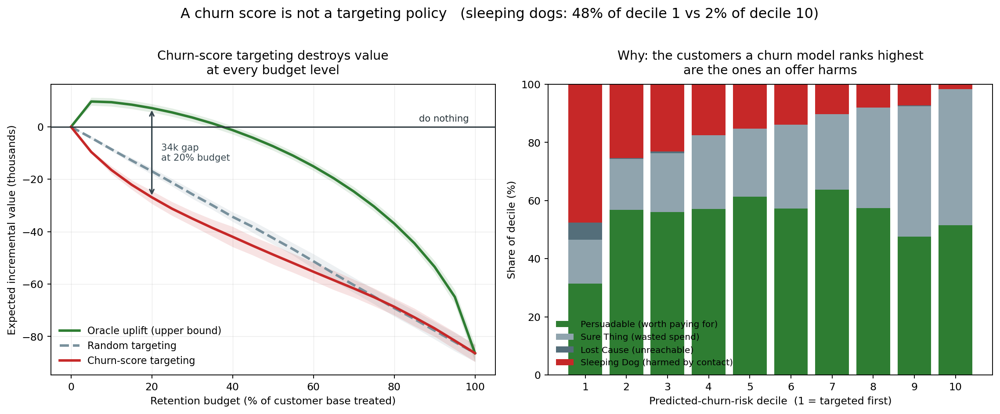
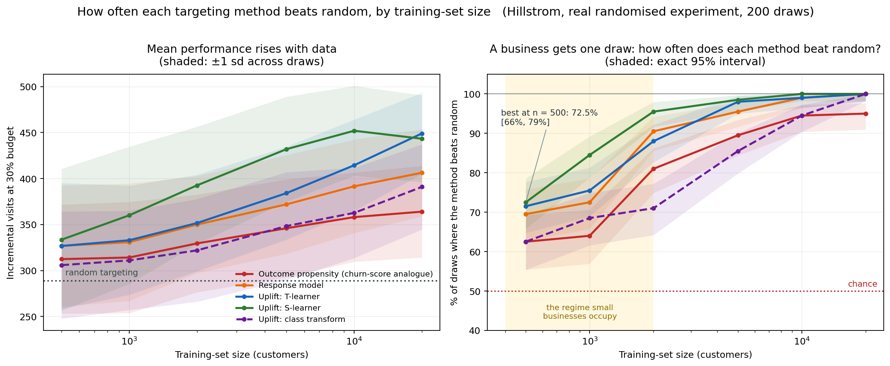

# RetainIQ — Retention Decisioning Under Small-Sample Causal Uncertainty

**Comprehensive Project Report and Technical Defence**

---

| | |
|---|---|
| **Student** | Prasham Jain |
| **Registration Number** | 2427030155 |
| **Programme** | B.Tech, Computer Science and Engineering |
| **Semester / Year** | V Semester, 3rd Year |
| **Mentor** | Dr. Rishi Gupta |
| **Date** | Submitted 11 August 2026 · revised 5 and 8 October 2026 (see the revision note) |
| **Repository** | `https://github.com/PrashamJ17/PBL-Proj` (private when submitted; public since August 2026) |
| **Archived** | Paper `10.5281/zenodo.22009470` · software `10.5281/zenodo.22025879` · data `10.5281/zenodo.22025123` |

---

## Revision note — 5 October 2026

This report was submitted on 11 August 2026. That version is commit `6e05749` in the
repository's history. It has been revised once, for three reasons.

**1. Claims of novelty were wrong.** After submission, the four papers closest to this
work were read in full (decision log, D-068). Three things this report presented as the
project's own were already published: that risk-based targeting can be actively harmful,
that the correlation between a customer's risk and their response explains when, and that
a targeting rule should be judged in money. §2, §4C, §5.3, §10, §12, §13, §14 and the
references are corrected, and §10.5 records the error.

**2. One result was re-measured and one figure redrawn.** The table in §5.3 shows the
values measured on 15 August 2026, with the Hillstrom experiment split into its two arms.
Figure 2 was redrawn on 5 October so that the simulator point cannot be read as comparable
with the others.

**3. Work was completed after submission.** The measurement layer was built and validated
(§5.9, new), the paper, software and data were archived publicly, and the test suite grew
from 433 to 487.

**What was and was not re-run.** §5.1, §5.2, §5.3, the abstention table in §5.8, and the
figures in §10.3 and §10.4 were
re-run on 5 October 2026 and agree with what is printed, with one exception: the win rate
before the D-057 correction, quoted in §10.2, prints as 74% and the submitted version said
75%. §5.4 to §5.7, the offer-ladder
table in §5.8, §7.3 and §11 were not re-run. Statements about commercial tools were not
re-checked.

**Addendum, 8 October 2026.** Two faults in the client report were fixed (D-071): it showed
every amount in rupees whatever the export's currency, and with no invoice file it showed
unmeasured quantities as 0% and gave advice built on them. The tests that two earlier fixes
had folded into existing ones were separated. The small-sample result in §5.4 was re-run at 200 draws and
its figures corrected (D-072); Figure 3 was redrawn from that run. The counts in §1, §9 and
§11 are updated:
590 tests in 27 files, 73 decisions. Nothing else in the report changed.

**Second addendum, 8 October 2026.** The two pieces of work the revision note listed as
owed were done, each with its predictions written down beforehand
(`docs/PREREG-checks-and-baseline.md`). **The correlation result was re-measured over
thirty splits (D-074), and §5.3 is rewritten:** the figure quoted for the Hillstrom men's
e-mail, +0.69, was one split and the highest of the thirty; most of the positive
correlation in the real experiments belongs to the probability scale; and the simulator's
result holds for fitted models on a simulated trial, without an oracle. Figure 2 is
replaced. **Lemmens and Gupta's (2020) rule was run beside the abstention rule (D-075),
and §4C, §5.8, §12 and §14 say what it showed:** abstention loses less from about 1,000
customers and is not ahead below that. Seven of the eleven predictions failed in whole or
in part, and they are listed. The counts in §1, §9 and §11 are updated again: 721 tests
in 30 files, 75 decisions.

**Third addendum, 8 October 2026.** The one further check the second addendum left owed
was run, again with its predictions written down first
(`docs/PREREG-pooled-independent-risk.md`, D-076). It was meant to say why the correlation
moves when the risk model is fitted on different customers. It answered that, and a
prediction that failed led to something not looked for: **the wide range reported for the
two Hillstrom rows in §5.3 was produced by the classifier, which stops fitting early by
default once it has more than 10,000 rows.** §5.3 says so, gives the figures with that
default switched off, and corrects the explanation the decision log had given (D-074).
Three of the five new predictions held. Counts: 750 tests in 30 files, 76 decisions.

**Fourth addendum, 9 October 2026.** The classifier was then fixed so that it always runs
the same number of rounds, and the correlation table and the small-sample result were
measured again, with two checks and six predictions written down first (D-077). All eight
held. The small-sample figures in §5.4 are unchanged. **The table in §5.3 is the
measurement of 8 October and is superseded**: the current table is in the repository's
README and in D-077. It now leads with risk fitted on control customers only, on customers
the effect model never saw, which is the definition in Ascarza (2018). On that definition
the figures are +0.43 for Criteo, +0.17 for the men's e-mail, +0.07 for Lenta, −0.01 for
the women's e-mail and −0.14 for the simulated trial. The research paper is being
rewritten from these results. 77 decisions; the number of tests is unchanged.

---

## Table of contents

*[Revision note — 5 October 2026](#revision-note--5-october-2026)*

1. [What is the project?](#1-what-is-the-project)
2. [Why is it necessary? What problem does it solve?](#2-why-is-it-necessary-what-problem-does-it-solve)
3. [The solution](#3-the-solution)
4. [Technical explanations: models, algorithms, and why these and not others](#4-technical-explanations-models-algorithms-and-why-these-and-not-others)
5. [Results](#5-results)
6. [How do we know it is trustworthy?](#6-how-do-we-know-it-is-trustworthy)
7. [Data, training, and the cold-start problem](#7-data-training-and-the-cold-start-problem)
8. [Architecture and codebase](#8-architecture-and-codebase)
9. [Testing and engineering discipline](#9-testing-and-engineering-discipline)
10. [What did not work](#10-what-did-not-work)
11. [Comparison with a sibling project (RetainIQ-PBL)](#11-comparison-with-a-sibling-project-retainiq)
12. [Limitations](#12-limitations)
13. [Future work](#13-future-work)
14. [Anticipated examination questions](#14-anticipated-examination-questions)
15. [References](#15-references)

---

## 1. What is the project?

**RetainIQ** is a retention *decisioning* system for small subscription businesses. It does
not primarily answer "who will churn." It answers three harder questions:

1. **Who should we treat**, given that treating some customers actively destroys value?
2. **With which intervention**, from a ladder ordered by margin cost?
3. **Does it pay**, measured in currency against doing nothing?

And it does something unusual for an ML system: **it abstains** when the evidence is too
thin to justify spending money, rather than producing a confident recommendation anyway.

The project comprises a calibrated agent-based simulator with exact ground-truth
counterfactuals, a point-in-time-correct feature store, a discrete-time survival model
with competing risks, a hierarchical Bayesian treatment-effect estimator, an offer-ladder
optimiser, a client-facing diagnostic report, a holdout measurement layer, and a research
paper published as a preprint.

**Scale (8 October 2026):** 15,719 lines of Python in `retainiq/`, 7,845 lines of tests,
750 automated tests in 30 files, 76 documented design decisions, 9,416 lines of
documentation in `docs/` and `explainer/`, continuous integration across Python 3.11, 3.12
and 3.13 with four gates. At submission: 12,551 lines of Python, 433 tests, 63 decisions.

---

## 2. Why is it necessary? What problem does it solve?

### The commercial problem

Subscription businesses lose customers continuously. A 5% monthly churn rate compounds to
roughly 46% of the customer base lost per year. The standard industry response is to rank
customers by predicted churn probability and send the top slice a discount.

**This response is not merely ineffective. Under identifiable conditions it loses money.**

### Why ranking by churn risk fails

There are four types of customer, defined by what happens with and without an
intervention:

| | **Stays if treated** | **Churns if treated** |
|---|---|---|
| **Stays if untreated** | *Sure Thing* — money wasted | ***Sleeping Dog*** — you caused the churn |
| **Churns if untreated** | ***Persuadable*** — the only profitable group | *Lost Cause* — money wasted |

A churn score ranks by *risk*, not by *responsiveness*. The customers it ranks highest
include dormant subscribers who have half-forgotten they are paying. A retention email to
such a customer is a reminder to cancel. **You have paid money to destroy revenue.**

This is the Sleeping Dog mechanism. In this project it is an assumption built into the
simulator. The evidence that contact can raise churn in real businesses comes from
published field experiments, summarised next.

### What is already known, and what is not

Most of the argument above is established, and none of it is this project's.

- **Ascarza (2018)** ran two field experiments, on 12,137 and 2,100 customers. Targeting
  customers by how much an offer changes their behaviour reduced churn more than targeting
  the riskiest. In the second experiment, targeting the riskiest 40% *raised* churn by 4.4
  percentage points. A web appendix simulates the correlation between a customer's risk and
  their response, and shows that it decides how badly risk targeting does.
- **Ascarza, Iyengar and Schleicher (2016)** ran a randomised retention campaign on 64,147
  telecom customers. Churn rose from 6.4% to 10.0% among those contacted.
- **Lemmens and Gupta (2020)** target on expected profit instead of expected churn, and
  choose how many customers to contact using held-out data.
- **Devriendt, Berrevoets and Verbeke (2021)** compare uplift and churn models on 200,903
  bank customers, scored in profit.

So it is prior work that risk targeting is ineffective, that it can do harm, why, and that
a policy should be judged in money. The questions these studies leave open are the ones
this project addresses:

1. **How small can the data be?** Ascarza names the size of the pilot as an open question.
   None of the four studies fits a model on fewer than about 700 customers.
2. **What happens when churn is low and an offer's effect is small?** The three targeting
   studies work at 25–62% churn. A subscription business with 3% monthly churn and an
   offer worth one percentage point is a different regime.
3. **Can a small business even measure whether its campaign worked?**

### Why small businesses specifically

The retention experiments above involve between 2,100 and 200,903 customers, and the
public uplift benchmarks used in §5.3 run to millions. The subscription
businesses where retention economics are most acute have *hundreds*. Existing tooling
requires roughly 500 customers with substantial history before it produces any prediction
at all. Below that threshold, nothing exists.

---

## 3. The solution

A five-layer architecture. The value concentrates in layers 3–5, which is where existing
tools are absent.

```
1. CONNECT      Stripe / Razorpay / Chargebee / CSV exports
                     |
2. CANONICAL MODEL + POINT-IN-TIME FEATURE STORE
                Every fact carries occurred_at AND available_at.
                As-of joins only; leakage is structurally impossible.
                     |
3. THE MODELS   Voluntary churn: discrete-time competing-risks hazard
                Involuntary churn: retry-timing and decline-code model
                Customer value:   CLV with uncertainty, refusing to extrapolate
                Treatment effect: hierarchical Bayesian CATE with a posterior
                     |
4. THE POLICY   maximise  E[-Delta_p * V - c]  over the offer ladder,
                subject to budget, and ABSTAIN when too uncertain
                     |
5. ACT + PROVE  Client report, CSV worklists, dashboard,
                permanent randomised holdout (Phase 6: built, no client yet)
```

### The offer ladder — the product opinion

Interventions are ordered by **margin cost, ascending**. Discounts are the last resort,
not the first.

| Rung | Intervention | Margin cost |
|---|---|---|
| 0 | Do nothing (abstain) | 0 |
| 1 | Feature nudge / education | ~0 |
| 2 | Check-in call | staff time |
| 4 | Pause subscription | deferred revenue |
| 5 | Plan downgrade | partial revenue |
| 7 | Time-boxed discount | direct margin |
| 8 | Deep discount | heavy margin |

Rungs 0–5 are where margin is preserved. Most competing products begin at rung 7.

---

## 4. Technical explanations: models, algorithms, and why these and not others

### A. Discrete-time survival hazard (not a binary classifier)

**What:** one row per customer per month at risk; model the monthly hazard
`h(t) = P(churn at t | survived to t)`; chain to get the survival curve.

**Why not a binary classifier?** Three reasons, in order of severity:

1. **Censoring.** A customer who has not churned *yet* is not a negative example — they
   are censored. Treating them as negatives biases every estimate.
2. It answers "if" but not "when", and "when" sizes the intervention window.
3. The label requires an arbitrary horizon, which silently changes the target.

**Competing risks:** voluntary churn (a decision) and involuntary churn (a failed card)
are modelled as **separate processes and never summed**. Merging them — which most
published churn models do — makes 20–40% of the problem invisible to the model meant to
explain it.

**Calibration over discrimination.** These probabilities get multiplied by revenue, so
being correctly *scaled* matters more than being correctly *ordered*. The project reports
integrated Brier score and D-calibration, not only AUC.

### B. Hierarchical Bayesian CATE with adaptive pooling

**What:** `logit P(churn) = alpha + x'beta + T(tau_0 + x'gamma)`, where `tau_0` is the
average treatment effect and `gamma` its heterogeneity. The heterogeneity scale
`sigma_gamma` is given a prior and **estimated from the data** rather than fixed.

**Why this and not a T-learner or causal forest?** This is the core methodological choice.
When heterogeneity is not identifiable — the normal situation at n = 500 — the marginal
likelihood drives `sigma_gamma` toward zero, every individual estimate collapses onto the
population effect, and the model **degrades gracefully** into "estimate one average effect
well" instead of "estimate 500 individual effects badly."

A T-learner cannot do this: it fits two separate models and differences them, so its
per-customer estimates stay noisy no matter how little signal exists — and the noise is
exactly what a top-k rule then ranks on.

**Why Laplace rather than MCMC?** `tau_i` is linear in the parameters, so under a Gaussian
posterior on the coefficients its own posterior is exactly Gaussian: closed form, no Monte
Carlo error inside the decision rule. The approximation was **validated against NUTS** —
posterior widths agree within 1%, means correlate above 0.9998.

### C. The abstention rule

Treat customer *i* only when

```
P( -Delta_p_i * V_i > c_i | data )  >  1 - alpha
```

In words: only when we are confident enough that the **money** gained exceeds the money
spent. Not that the effect is positive — that it is large enough, on a customer valuable
enough, to be worth the offer.

Three properties, each tested:

- It **ranks on money, not effect**. A large effect on a cheap customer loses to a small
  effect on a valuable one.
- It **abstains rather than filling the budget**. Every top-k rule spends its whole budget
  by construction; there is no k at which it declines.
- It **degrades correctly**: as the posterior concentrates it becomes a point-estimate
  threshold; as it widens it treats nobody.

**What is and is not new here.** Deciding on expected profit is established: Lemmens and
Gupta (2020) train and evaluate on it. A threshold that takes uncertainty into account is
suggested, and not implemented, in a footnote of Ascarza (2018). What this project adds is
an implementation with a posterior and a test of whether it holds up on a few hundred
customers (§5.8). Lemmens and Gupta's own rule for choosing campaign size is the nearest
rival. It was re-implemented from their paper and run on the same simulated pilots
(§5.8, D-075).

### D. Point-in-time correctness

Every fact in the canonical schema carries **two** timestamps: `occurred_at` (when it
happened) and `available_at` (when it became knowable). Features filter on the second,
never the first, and a single code path (`FeatureStore._visible`) is the only route to
source data.

**Why this matters is measured, not asserted** — see §5.

### E. Tooling choices

| Choice | Why |
|---|---|
| numpy / pandas / scipy only in the core | Heavy ML libraries are optional extras. The diagnostic must run anywhere. |
| Self-contained HTML reports (no server) | Can be emailed, opened offline, printed. Asks less trust than a login. |
| argparse CLI, no framework | The delivery path adds no dependency. |
| pytest + GitHub Actions, 3 Python versions | Four CI gates: tests, calibration, leakage, and the founding experiment. |

---

## 5. Results

Every number below is regenerable from the repository by a single command.

### 5.1 The founding result (Phase 0)

Using a simulator with **exact ground-truth counterfactuals**, a churn-score-ranked
retention campaign was compared against random targeting and against doing nothing.

- **Churn-score targeting loses money, and is worse than random targeting on 6 of 6
  seeds.**
- **Restraint beat ranking:** contacting 209 customers earned more than contacting 718.
- **A more accurate churn model can reduce profit**, because accuracy at detecting
  disengagement is precision at finding Sleeping Dogs.



***Figure 1.*** *Left: expected incremental value against retention budget. Churn-score
targeting (red) sits below random targeting (dashed) at every budget, and both sit below
doing nothing. The oracle curve is an upper bound computed with ground-truth effects, not
an achievable policy; the gap to it at a 20% budget is roughly 34,000. Right: the
composition of each predicted-churn-risk decile. **Sleeping Dogs are 48% of decile 1 —
the customers targeted first — and 2% of decile 10.** That inversion is the mechanism: a
churn model ranks highest precisely the customers an offer harms.*

### 5.2 The cost of leakage (Phase 1)

The same features, computed correctly and incorrectly:

| Feature construction | Apparent AUC |
|---|---|
| Point-in-time correct | **0.606** |
| Ignoring reporting delays (subtle error) | 0.615 |
| No time filter at all (common error) | **0.954** |

**A 0.35 inflation.** (The submitted version printed 0.603 for the first row, from the
paper's configuration; the command prints 0.606.) The dangerous property is that leakage makes results look *better*,
and nobody investigates a number that improved.

### 5.3 External validation on real randomised experiments

The project's central claim did **not** replicate on the first real dataset. Rather than
discard it, the failure was diagnosed, which led to measuring on real data a quantity
taken from the literature.

**The quantity: `corr(tau, propensity)`** — the correlation across customers between the
estimated treatment effect and the estimated outcome propensity. It is not introduced
here. Ascarza (2018, Web Appendix A3.4) varies this correlation in a simulation and places
her two field studies at about +0.2 and −0.2. This project measures it from fitted models
on three public randomised experiments.

| Setting | `corr(tau, pi)`, probability scale | Same, risk fitted on other customers | Same, log-odds scale | Advantage of effect-based targeting | Extra outcomes per 1,000 customers |
|---|---|---|---|---|---|
| Criteo (advertising) | +0.58 [+0.51, +0.65] | +0.56 [+0.43, +0.68] | +0.06 [−0.13, +0.33] | +0.7% [−1.5, +3.8] | +0.1 [−0.1, +0.3] |
| Hillstrom, men's e-mail | +0.28 [−0.21, +0.66] † | +0.19 [+0.01, +0.39] | −0.46 [−0.73, +0.06] | −0.1% [−10.3, +11.6] | −0.1 [−3.0, +2.8] |
| Hillstrom, women's e-mail | +0.18 [−0.07, +0.49] † | +0.11 [−0.09, +0.32] | −0.22 [−0.44, +0.11] | +14.0% [−7.7, +35.3] | +2.6 [−1.9, +6.2] |
| Lenta (retail promotion) | +0.13 [+0.05, +0.22] | +0.13 [−0.00, +0.31] | −0.05 [−0.18, +0.06] | +24.7% [−4.3, +109.1] | +0.6 [−0.1, +1.5] |
| Subscription churn (simulated trial, fitted models) | −0.21 [−0.33, −0.07] | −0.17 [−0.31, −0.01] | −0.26 [−0.40, −0.10] | not quoted | +9.7 [+5.0, +14.4] |

*† With the classifier's early stopping switched off these two are +0.30 [+0.17, +0.42] and
+0.16 [+0.04, +0.31]. See "The Hillstrom ranges" below. The second column of figures fits
the risk model on customers the effect model never saw; it rests on half the data.*

*Measured on 8 October 2026 (D-074): the mean over thirty random splits of each
experiment, with the 2.5th and 97.5th percentiles across splits. The table this replaces
showed one split per row: +0.69 and −5.6% for the Hillstrom men's e-mail, +0.58 and +0.6%
for Criteo, +0.19 and +12.7% for the women's e-mail, +0.17 and +20.3% for Lenta, and an
oracle's +106.9% for the simulator.*

**What the thirty splits changed.**

- **The Hillstrom men's figure was the highest of thirty splits.** The mean is +0.28 and
  splits run from −0.21 to +0.66. The advantage quoted beside it, −5.6%, averages −0.1%
  and is positive on 15 splits of 30. The other three experiments were close to their
  means. The split was not chosen for its result, it is the default, but it was quoted
  with no idea of how far splits differ.
- **Most of the positive correlation belongs to the probability scale.** An offer that
  multiplies every customer's odds by the same factor moves the probability most where
  the baseline is highest, and that alone produces a positive correlation. On the
  log-odds scale none of the four real figures is clearly positive. Ascarza (2018) warns
  of this.
- **How risk is defined changes the figure.** With risk fitted on control customers by the
  same model the effect subtracts, the correlation falls by 0.14 to 0.43 in the real
  experiments, and *rises* in the simulator, where the outcome is churn. Both are shared
  estimation noise. Fitted on different customers, the figure for the two Hillstrom
  e-mails does not return to the value in the table. A further check (D-076) took that
  movement apart one change at a time. Sharing customers between the two models inflates
  the figure in every real experiment, by 0.05 at most. The larger part, where the
  movement was large, is the definition itself: risk fitted on control customers only,
  which is Ascarza's definition, gives a lower figure than risk fitted on both arms, which
  is what the table uses, by 0.08 for Criteo and 0.12 for the women's e-mail.
- **The Hillstrom ranges.** *(Added in the third addendum.)* The ranges for the two
  Hillstrom rows are far wider than the others, and the decision log (D-074) put that down
  to noise shared between two models. A prediction built on that explanation failed. The
  cause is the classifier: by default it stops fitting early once it has more than 10,000
  rows, and each arm of the Hillstrom training data has about 10,650. The effect is the
  difference between a model fitted on the treated arm and one fitted on the control arm,
  and each stopped at its own point, anywhere from 25 to 150 rounds; they stopped at the
  same round on one split in thirty. The split that gave +0.69 had 70 rounds against 26.
  With early stopping off the same split gives +0.35, and the thirty run from +0.09 to
  +0.47. The means hardly move (+0.28 to +0.30, +0.18 to +0.16), and neither the log-odds
  figures nor the gains in the last column change. The classifier itself has not been
  changed: that would alter every figure fitted on more than 10,000 rows, and it is left
  as a decision (§12). Results fitted on 10,000 rows or fewer, which include §5.4, are
  not affected.
- **In the simulator, fitted models find the direction on every split.** On a randomised
  trial of 60,000 simulated customers, the effect-based model beat the outcome model on
  30 of 30 splits, and targeting by the outcome model added churn on 26. The earlier
  table showed an oracle here; this row is measured like the others.

**Interpretation.** In the four real experiments the range of the effect-based model's
advantage across splits includes zero, and the four cannot be ordered. The advantage is
positive on 27 of 30 splits for the women's e-mail and for Lenta, on 20 for Criteo and on
15 for the men's e-mail; the splits overlap, so those counts are not a significance test. When effect-ordering and
propensity-ordering largely coincide, the outcome model does as well, because it solves an
easier estimation problem. That is a statement about estimates from a finite sample.

**An out-of-sample prediction that landed.** Before obtaining the Lenta dataset, it was
predicted that retail promotion would fall *between* advertising and retention. On the
split then run it came in at +0.17, and over thirty splits at +0.13, as predicted, though
underpowered to test the downstream consequence.

**What is not claimed.**

- **That the four real settings form two groups, or any order.** An earlier reading of
  this table as "high-correlation" and "low-correlation" settings is withdrawn.
- **That a positive correlation means likelier responders are more persuadable.** On the
  log-odds scale it is not there.
- **That the contrast with the simulator holds on every scale.** On the log-odds scale
  the simulator is not set apart from the two Hillstrom e-mails.
- **That the simulator's negative correlation was found.** It is configured. None of the
  three real experiments is a retention experiment.
- **That the simulator row says anything about a small business.** It is a trial of
  60,000. At 250 to 4,000 customers no policy tested beats doing nothing (§5.8).
- **A percentage for the simulator row.** The base it would be divided by is negative on
  26 splits of 30. The oracle's +106.9% is money net of the offer on true effects, and is
  not comparable with any row here.

Five predictions were written down before the run. One held (the two correlation
coefficients agree), one held and counts against the project (the log-odds scale), one
failed outright (the two groups), and two failed in part (D-074). Five more were written
down before the further check: three held, one failed (that sharing customers explains
the spread between splits), and one failed in a single experiment (D-076).


***Figure 2.*** *Replaced 8 October 2026. Each point is one setting: the mean over thirty
splits, with bars from the 2.5th to the 97.5th percentile across splits on both axes. The
x-axis is the correlation across customers between estimated benefit and estimated
outcome propensity, on the probability scale in the left panel and on the log-odds scale
in the right. The y-axis, shared, is the number of extra good outcomes per 1,000
customers from ranking by effect instead of by outcome propensity. Every point is a
fitted model on a randomised trial. The simulator's point comes from a simulated trial
whose negative correlation is configured. Five settings, not a fitted curve.*

### 5.4 Reliability at small *n*

Holding the evaluation set fixed and shrinking **only** the training set on a real
64,000-customer experiment:

- At n = 500, the best of five methods beats random targeting on **72.5% of 200 draws**
  (exact 95% interval 66% to 79%).
- The weakest of the five is at **62.5%** (55% to 69%).
- The best method reaches 84.5% at 1,000, 95.5% at 2,000 and 98.5% at 5,000.
- At n = 500 a plain response model (69.5%) is within noise of the best uplift model.

*Corrected on 8 October 2026 (D-072). The submitted version said 75% and "55%, a coin
flip", from twenty draws and with no interval. Fifteen wins in twenty is compatible with
anything from 51% to 91%.*

Reported as a **win rate, not a mean**, because a business gets one draw. A method with a
good average and a wide spread is a gamble.



***Figure 3.*** *Left: mean incremental visits at a 30% budget, by training-set size, for
five methods on the Hillstrom randomised experiment. Every method improves with data and
every one beats random on average — the shaded ±1 standard deviation bands show why that
is misleading. Right: the proportion of seeds on which each method actually beat random.
The shaded bands are exact 95% intervals. At 500 customers the five methods lie between
62.5% and 72.5%.
**The left panel is the number usually reported; the right panel is the one a business
experiences.***

### 5.5 Survival benchmarks (Phase 3)

Against Cox proportional hazards, Random Survival Forest and DeepSurv on **Telco**, a
public dataset of 7,032 real subscription customers:

| Model | Integrated Brier (lower is better) |
|---|---|
| **RetainIQ (discrete-time hazard)** | **0.0824** |
| DeepSurv | 0.0825 |
| Cox PH | 0.0914 |
| Random Survival Forest | 0.0964 |

**Beats two of three on 10 of 10 repeats; ties the third.** The DeepSurv difference is
0.0824 against 0.0825, which is noise, and calling it a win would be dishonest.

As predicted in advance, the method **loses** on GBSG2 (a medical dataset with no
time-varying covariates), because its advantage is handling covariates that change — which
that dataset does not have.


***Figure 4.*** *Left: predicted against observed (Kaplan–Meier) survival at month 29 on
Telco. A perfectly calibrated model lies on the diagonal with slope 1. Cox (1.19) and
Random Survival Forest (1.25) are systematically off; DeepSurv (1.02) and the discrete-time
hazard (1.06) are close. This matters because these probabilities get multiplied by
revenue — being correctly scaled is worth more than being correctly ordered. Right: the
share of simulated businesses where using time-varying covariates beats a signup-time
snapshot. The advantage is decisive from 500 customers upward and **collapses to a coin
flip at 250**, which is the honest lower bound on who this can help.*

### 5.6 Involuntary churn: more dunning is not better dunning

Failed payments are 20–40% of subscription churn and need almost no machine learning. Six
retry-and-email policies were compared on simulated billing data with realistic decline
codes.


***Figure 5.*** *Left: net value of six dunning policies. The aggressive policy uses roughly
two and a half times as many retries and nearly four times as many emails as the best
policy, and recovers **no more money** — it is strictly dominated. What works is
conditioning on the decline code: `insufficient_funds` means the money has not arrived yet
and wants a retry timed to payday, while an expired card cannot be charged again however
many times it is tried. Right: a sensitivity analysis on the one quantity that was assumed
rather than measured — the goodwill cost of a payment-failure email. It shows where the
conclusion would flip, so a reader can judge the assumption instead of taking it on trust.*

An early version of this experiment reported the aggressive policy recovering 21.7%, which
was wrong: retries against a dead card were allowed to compound. After correcting the
decline-code handling, the aggressive policy became **strictly dominated** — a cleaner and
more useful finding than the original.

### 5.7 Value at risk is not churn risk

Ranking customers by **probability of leaving** and by **money at risk** (value × that
probability) produces two top-decile lists that **overlap by only 21%**.

A churn score points at the wrong four-fifths of the money — before any causal argument is
made. This is arithmetic, not modelling.

### 5.8 The decision layer (Phases 4–5)

With ground truth withheld from every policy, 20 draws per size:

| n | Beats ranking | Beats doing nothing | Ties it | Treated (abstain / rank) |
|---|---|---|---|---|
| 250 | 95% | 20% | 70% | 5 / 23 |
| 500 | 85% | 5% | 70% | 12 / 46 |
| 1,000 | 95% | 5% | 80% | 14 / 90 |
| 2,000 | 100% | 0% | 70% | 27 / 181 |
| 4,000 | 90% | 0% | 80% | 21 / 359 |

**Abstention beats ranking on 93% of draws overall**, spending a fraction as much
(mean realised value −524 against −2,919 for ranking). It does **not** beat doing nothing,
and the third column explains why: on roughly three-quarters of draws the rule treats
nobody and scores exactly zero.

*Re-run on 5 October 2026 and unchanged. `make abstention` prints this table first, and
beneath it the same draws under the rule as it stood before the D-057 correction (§10.2).*

**Against the nearest published rule** *(added 8 October 2026, D-075)*. Lemmens and Gupta
(2020) choose how many customers to target from held-out data: rank a validation sample,
estimate the profit of every campaign size from the randomised outcomes, take the best.
Their rule was re-implemented from their paper and given the same simulated pilots as the
abstention rule, 100 draws per size, with the design and six predictions fixed beforehand.
It must hold back half the pilot to choose the size on; the abstention rule fits on all
of it.

| n | Abstention, mean | Treats nobody | Their rule, mean | Treats nobody | Abstention ahead, of the draws that differ |
|---|---|---|---|---|---|
| 250 | −36 | 66% | 0 | 100% (could not act) | 9 of 34 — 26% [13%, 44%] |
| 500 | −431 | 65% | −378 | 74% | 23 of 49 — 47% [33%, 62%] |
| 1,000 | −189 | 74% | −1,282 | 34% | 58 of 74 — 78% [67%, 87%] |
| 2,000 | −396 | 75% | −2,946 | 26% | 61 of 78 — 78% [67%, 87%] |
| 4,000 | −691 | 81% | −3,939 | 24% | 62 of 79 — 78% [68%, 87%] |

*Money relative to doing nothing. Brackets are exact 95% intervals. A draw on which both
rules treat nobody is a tie and is left out of the last column.*

- **From 1,000 customers the abstention rule loses less.** Their rule acts on two or
  three draws in four there, on three to eight times as many customers, and loses about
  six to seven times as much.
- **At 250 and 500 it is not ahead.** At 250 it acts on 34 draws of 100 and loses money on
  25 of them, so doing nothing beats it. At 500 the two cannot be told apart.
- **At 250 their rule could not act at all, and that is this project's guard, not their
  method.** The comparison required ten treated and ten control customers inside any
  campaign size considered. A 30% budget on a validation sample of 37 allows 11. With that
  guard removed, a run added after the results were seen and labelled as such, their rule
  acts on three draws in four at 250 and the abstention rule is ahead on 70% [66%, 75%]
  of the draws that differ across all sizes.
- **When the abstention rule acts, it usually loses.** It acted on 139 of 500 draws and
  made money on 25. Its mean is negative at every size. What it gains over every rival
  comes from acting rarely and on few customers.
- **Their profit-based loss made no measurable difference** against their first stage
  alone at these sizes: ahead on 48% [42%, 54%] of the draws that differ.

Of the six predictions, two held, two failed (that their rule would treat nobody less
often at small sizes, and that the gap would close with size: it widens), and two hold
only when the three smallest sizes are pooled. **The claim this supports is narrower than
the one the project hoped to make:** from about 1,000 customers, declining by a posterior
threshold loses less than choosing a campaign size by validation. It is not "abstention
beats the published alternative when data are scarce".

**The offer-ladder optimiser** (choosing *which* intervention per customer, learned from a
randomised multi-arm pilot):

| Policy | Mean realised value | Share of oracle |
|---|---|---|
| Optimiser | 655 / 1,039 / 2,252 | **28%** |
| Best rung chosen from the pilot | 502 / **−562** / 1,869 | 13% |
| Best single rung, chosen with hindsight | 1,997 / 2,554 / 5,892 | 73% |
| Oracle over rungs | 2,348 / 3,747 / 8,242 | 100% |

The optimiser is the first estimated policy in the project to make money on average, and
captures roughly twice what the achievable alternative does — but beats it on only
**58% of draws, 95% CI [0.42, 0.72]**, which is not distinguishable from chance.

**The claimable finding is about the comparator.** A pilot-chosen best rung agrees with the
true best rung on **13% of draws** — against 17% for a random guess among six — and returns
*negative* money at n = 1,000. **Choosing the right default offer is worth far more than
matching offers to customers, and it is what a small business is least able to do for
itself.**

### 5.9 Measurement: what a small business can detect (Phase 6)

*Added in the October 2026 revision. Built and validated after submission (D-065).*

The measurement layer assigns a permanent holdout from a hash of the customer identifier,
records it in an append-only ledger, and reports incrementality as a difference in means
with an interval — never as a save rate among those contacted.

Validated against the simulator's known effect over 60 seeds per size, the estimator is
**unbiased**, with interval coverage between 88% and 98%.

The finding is what it cannot do:

| Customers | 10% holdout | Smallest detectable effect (80% power) | Effect delivered |
|---|---|---|---|
| 250 | 25 | 0.2363 | 0.0108 |
| 1,000 | 100 | 0.1181 | 0.0108 |
| 4,000 | 400 | 0.0591 | 0.0108 |
| 10,000 | 1,000 | 0.0374 | 0.0108 |

**The smallest detectable effect exceeds the delivered effect at every size tested.**
Detecting 0.0108 at 80% power with a 10% holdout needs roughly **119,500 customers**.
Campaigns nevertheless looked statistically significant on 0–10% of runs, which is the
false-positive rate: a business that reports only the campaigns that "worked" will
conclude that its programme is effective, on noise.


***Figure 6.*** *Left: measured lift with its 95% interval by business size, against the
true effect (dashed). The estimate is centred on the truth, and the interval is many times
wider than the effect. Right: the smallest effect a 10% holdout can detect, on a log
scale, against the effect delivered. The gap does not close within 10,000 customers.
Simulation only.*

---

## 6. How do we know it is trustworthy?

### 6.1 Ground truth, not proxies

The simulator emits **both potential outcomes** for every customer under common random
numbers, so `tau_i` is the exact counterfactual difference rather than an estimate of it.
No real dataset contains this. It is the only setting in which a CATE estimator can be
scored against per-customer truth.

### 6.2 Comparators are deliberately strong

The baseline ranks by `-tau_hat * V - c` using the **same estimator** and the **same
customer values**, so the comparison isolates *abstention* rather than the fact that
customers differ in worth. A weaker comparator would flatter the method for the wrong
reason. In Phase 5 the comparator is chosen **with hindsight** — an advantage no real
business has.

### 6.3 Predictions registered before results

Where a result could be shaped by knowing the answer, predictions were written down and
committed to version control **first**:

- The Lenta prediction (landed).
- Five predictions about the D-057 correction — **two of which failed**, and are reported
  as failures.
- A minimax-regret hypothesis, pre-registered and then **refuted** by its own
  out-of-sample test.

### 6.4 Invariants enforced by continuous integration

Fourteen invariants are documented, and the ones that can be are enforced automatically:
temporal splits only; latent variables never reachable from observable data; never
hand-tune the hazard intercept; voluntary and involuntary churn never summed; value always
measured against doing nothing; splits by subject and never by row; never extrapolate past
observed support.

CI runs on every push across three Python versions with four gates: tests, calibration,
**leakage**, and the founding experiment. The founding claim is re-verified on every commit.

### 6.5 What trustworthiness is *not* claimed

The client-facing report is **descriptive**: retention curves, revenue versus logo churn,
failed payments quantified. Every figure is a count or a sum from the client's own data,
and therefore checkable by them. The system deliberately does **not** promise per-customer
prediction, because §5.8 shows it cannot deliver it reliably.

---

## 7. Data, training, and the cold-start problem

### 7.1 Why a simulator, and why it is not the only data

| Purpose | Source | Why it is necessary |
|---|---|---|
| **Causal ground truth** | SubSim (own simulator) | Real data never contains the counterfactual. |
| **External validity** | Hillstrom, Criteo, Lenta (real RCTs) | Simulator-only results are desk-rejected, and reviewers are right to assume the simulator was tuned to favour the method. |
| **Benchmark comparison** | Telco (7,032 customers), GBSG2 | Standard datasets everyone reports on. |
| **Real-world proof** | Client engagements | Not yet obtained. Stated as an open gate. |

### 7.2 Calibration of the simulator

The simulator is not hand-tuned to produce a desired result. Its hazard intercept is
**solved by bisection** to hit a target churn rate, and a CI gate verifies four aggregate
properties against published industry benchmarks: monthly voluntary churn in
[3%, 7%], involuntary share of churn in [20%, 40%], 24-month retention in [22%, 50%], and
an early-to-late hazard ratio in [1.15, 3.0]. A second gate verifies the causal structure:
sleeping-dog share, persuadable share, and that the mean treatment effect stays beneficial.

During development, an early result was **rejected for being too favourable** — a
configuration producing 30% sleeping dogs and a harmful average effect made the headline
claim trivially true. The parameters were changed to make the claim *harder*, and it
survived.

### 7.3 The cold-start problem

A new business has no intervention data, so no treatment effect can be estimated. Three
mechanisms address this:

1. **The simulator** provides development and validation data before any client exists.
2. **Hierarchical priors** let a new tenant begin from what similar firms established
   rather than from ignorance. Measured effect: cross-tenant pooling cut mean losses from
   −457 to −62 at n = 500 by making a small firm treat 2 customers instead of 12.
3. **A deliberately budgeted randomised exploration phase** — the business is told
   explicitly that some spend is buying causal information.

### 7.4 Would this work for a different company?

The product is the **pipeline**, not a pre-trained model. A new tenant's own history is
ingested, its own features are computed under point-in-time rules, and its own models are
fitted. What transfers between tenants is the *prior*, not the parameters — and that
transfer is the mechanism in §7.3.

---

## 8. Architecture and codebase

```
retainiq/
├── core/        schema (occurred_at + available_at) · features (single data path)
│                leakage (availability audit, time-travel, canary injection)
├── ingest/      stripe · csv_ingest (alias resolution, recorded defaults)
│                preflight (is this export safe to compute from?) · subsim_adapter
├── sim/         config · latents (copula) · hazard · subsim
│                counterfactual (exact tau, common random numbers, offer ladder)
│                calibration · dunning
├── models/
│   ├── survival/  discrete (person-period hazard + competing risks)
│   │              metrics (KM, IPCW Brier, D-calibration — numpy only)
│   │              baselines (Cox · RSF · DeepSurv, each optional)
│   ├── uplift/    bayesian (Laplace posterior, validated vs NUTS) · abstention
│   └── clv/       value (CLV, value at risk, shortfall by cause)
├── policy/      dunning (6 retry policies) · economics (log-odds -> money)
│                ladder (per-customer rung choice from a multi-arm pilot)
├── report/      autopsy · render (HTML + print) · reasons (exact attribution)
│                worklist (CSV, descriptive only) · dashboard (self-contained)
├── experiments/ kill_test · leakage_penalty · dunning · survival_benchmark
│                clv · abstention · sensitivity · ladder · figures
├── benchmarks/  datasets (Hillstrom, Criteo, Lenta) · survival_data (Telco, GBSG2)
│                models · evaluate · small_n · spectrum
└── cli.py       preflight and autopsy against a real client export
```

**Design principles visible in the structure:**

- `core/features.py` exposes exactly one path to source data, so leakage cannot be
  introduced by accident elsewhere.
- Survival metrics are implemented in numpy so CI can run them without optional
  dependencies; they are validated against `lifelines` and `scikit-survival` separately.
- The decision layer consumes a posterior **already denominated in currency**, which makes
  a whole class of units error unrepresentable (see §10).

---

## 9. Testing and engineering discipline

**750 automated tests in 30 files, 7,845 lines of test code**, run on every push across Python 3.11,
3.12 and 3.13.

Tests fall into five categories:

| Category | What it protects |
|---|---|
| **Correctness** | Known answers computed by hand, not self-consistency |
| **Leakage** | Availability-timestamp assertions, time-travel checks, canary injection |
| **Calibration gates** | Simulator must match published benchmark ranges |
| **Edge cases** | Degenerate inputs raise errors about the *data*, not the solver |
| **Absence of change** | That a sensitivity analysis did not move its own baseline |

**Errors raise messages about the data.** A survival model given a single-outcome dataset
does not report an optimiser convergence failure; it says the outcome is constant and no
effect is identifiable from it. NaN covariates raise rather than being imputed, because
filling them is a loader's decision, not a model's.

**A documented decision log.** 73 entries recording *why* each modelling choice was made,
appended and never edited, so a later reader can see what was believed when.

**Roughly half the failing tests in this project turned out to be the test, not the code** —
recorded explicitly, because the instinct to "fix" the code first is exactly what produces
a wrong system that passes.

---

## 10. What did not work

This section exists because a project that reports only successes is not credible, and
because these are among the most useful results obtained.

### 10.1 The central claim did not replicate on real data

"Churn-score targeting is worse than random" failed to replicate on Hillstrom. Diagnosis
rather than rationalisation: Hillstrom has **no sleeping dogs** — every uplift decile is
positive — so worse-than-random is structurally impossible there. Criteo then *contradicted*
Hillstrom. Reconciling the two led to measuring `corr(tau, propensity)` (§5.3). **The
claim was scoped rather than defended.**

### 10.2 A units error ran for an entire phase (D-057)

The decision rule multiplied a **log-odds** treatment effect by customer value as though it
were a probability difference. On one draw it believed treating was worth −104.5 when the
truth was +20.5, against an offer costing 31.5.

The distortion is `1/(p0(1-p0))` — a factor of 4 at p₀ = 0.5, **25 at p₀ = 0.05** — so it
was *worst for the customers least likely to leave*. That is the Sure Thing quadrant: the
project reproduced its own central criticism inside its own decision rule.

**Every test passed, and none of them was wrong.** They were all self-consistency checks,
and a units error is consistent with itself. The lesson is stated precisely: *a suite of
self-consistency tests cannot detect a units error.* The test that now catches it asserts a
value computed by hand.

Correcting it reduced losses from −3,531 to −1,070 and improved the win rate against
ranking from 74% to 93% — and **changed no qualitative conclusion**.

### 10.3 A gate that could not have been passed

Phase 4 required beating both ranking *and* doing nothing. A sensitivity analysis showed
these are in tension: as the effect size grows, beating ranking falls from 90% to 48% while
beating inaction rises from 5% to 68%, monotonically, and **at no setting is either
significantly above chance while the other also is.** The gate demanded two properties that
trade off. That is a defect in the gate, and it is reported as one rather than as evidence
for the method.

Underneath it is arithmetic: break-even requires |tau| > 0.040 while the offer delivers
0.010, so an *oracle* would treat only **5.8%** of customers.

### 10.4 A hypothesis proposed, then refuted by its own test

The sensitivity suggested the method was valuable as a *hedge* — never best, never
catastrophic. Because that reading was formed after seeing a failure, it was pre-registered
and tested on data that played no part in forming it. **It failed:** random assignment
hedged better (58.9% versus 85.7% maximum regret; 86.1% under the corrected rule of
§10.2). Withdrawn and recorded.

### 10.5 A claim of novelty that the literature had already made (D-068)

The submitted version of this report said that Ascarza (2018) had shown risk targeting to
be *ineffective*, and that this project's contribution was to show when it becomes
*harmful*, through a "governing quantity". Both halves were wrong. Her second field
experiment shows risk targeting raising churn, and her web appendix simulates the same
correlation. The decision log had recorded an instruction to check the closest prior work
before writing; that check was not done until after this report and the paper were
written.

What survives is narrower: evidence on how small a pilot can be (§5.4), the measurement
floor (§5.9), and the correlation measured on public experiments, including settings where
the effect-based model does no better. Reading the measurement code beside her appendix
also showed that the simulator row in §5.3 had been presented as comparable with the real
rows when it is not.

---

## 11. Comparison with a sibling project (RetainIQ-PBL)

RetainIQ-PBL (repository `PrashamJ17/RetainIQ-PBL`, referred to throughout by its full
repository name to distinguish it from this project) is a prior project by the same
author: an e-commerce retention dashboard on the
Olist Brazilian dataset, using RFM segmentation, K-Means, an XGBoost churn classifier and
SHAP explanations, deployed with FastAPI and Next.js. It was analysed as an external
comparison, and **its code was executed rather than its report read**.

### 11.1 An independent replication of this project's leakage finding

RetainIQ-PBL's report states Accuracy 0.9987, F1 0.9992 and **ROC-AUC 1.0000**, describing the
model as having "learned the patterns flawlessly," with a footnote that recency acts as a
near-perfect deterministic feature. That footnote is the whole story: the label was "no
purchase in 90 days" and recency is days since last purchase, so `recency >= 90` **is** the
label.

A later commit correctly implemented an out-of-time split and resolved the leakage. **The
report was never re-run.** Executing the current code gives:

| Metric | Reported | Actual (current code) | Trivial baseline |
|---|---|---|---|
| Accuracy | 0.9987 | **0.8676** | 0.9945 (always predict churn) |
| F1 | 0.9992 | **0.9290** | 0.9972 (always predict churn) |
| ROC-AUC | 1.0000 | **0.5434** | 0.5000 |

A constant "everyone churns" beats the trained model on both accuracy and F1.

**This is an independent replication of this project's Phase 1 result** (0.606 correct
versus 0.954 leaked) at larger magnitude, on real data, in a different vertical, by a
different pipeline. It is the strongest available evidence that point-in-time correctness
earns its engineering cost.

### 11.2 A second finding: the problem statement was wrong

At a 99.4% churn base rate the task is degenerate. Olist is a *marketplace* — mostly
one-time buyers, non-contractual, where churn is latent and unobservable. A binary 90-day
label is the wrong construct (Fader & Hardie); it requires BTYD models such as Pareto/NBD.

This is precisely why RetainIQ began with **contractual** subscriptions and deferred
non-contractual to a later phase behind a model router.

### 11.3 An honest accounting of what RetainIQ-PBL does better

| RetainIQ-PBL has | RetainIQ has |
|---|---|
| A deployed frontend and live API | No user interface in production |
| SHAP per-customer explanations | Exact closed-form attribution (no dependency) |
| RFM segmentation, CRM activation layer | Neither |
| Docker orchestration, hosted deployment | Local CLI only |
| 0 automated tests, no CI | 750 tests, CI on 3 Python versions, 4 gates |
| Correlational churn prediction | Causal effect estimation with ground truth |
| Binary classifier (ignores censoring) | Survival model with competing risks |
| 2 documentation files | 76 decision entries, 9,416 documentation lines |

**Both directions are recorded.** RetainIQ-PBL's gate — "somebody can use it" — is met, and
RetainIQ's is not.

---

## 12. Limitations

Stated plainly, because the alternative is having a reviewer state them.

1. **No paying client and no live deployment.** Every result is from simulation or public
   datasets. The commercial claim is untested.
2. **The negative-correlation regime is carried by a simulator configured to have it.**
   None of the three real experiments is a retention experiment. Fitted models recover
   the simulator's result on a simulated trial of 60,000 (§5.3), which shows the
   estimator works there and nothing about real customers.
3. **The correlation depends on the scale, on how risk is defined, and on how the models
   are fitted.** Over thirty splits, most of the positive correlation in the real
   experiments is absent on the log-odds scale, and the figure moves by up to 0.43 with
   the definition of risk. The benchmark's classifier stops early by default above 10,000
   rows, which made the two Hillstrom figures unstable (§5.3, D-076). The classifier has
   not been changed, and whether the Criteo and Lenta figures would move with a fixed
   stopping rule has not been measured.
4. **Against the nearest published method, the abstention rule is ahead only from about
   1,000 customers.** Lemmens and Gupta's (2020) rule was re-implemented from their paper,
   not run from their code, and the comparison is on a simulator (§5.8, D-075).
5. **The small-sample result rests on one dataset that is not retention data.** The
   figures in §5.4 are from an e-mail promotion.
6. **The decision layer does not beat doing nothing.** It reliably avoids the damage that
   ranking causes; it does not manufacture profit the data cannot support.
7. **The offer optimiser's advantage is not statistically significant.** 58% on 45 draws,
   CI [0.42, 0.72].
8. **Below roughly 250 customers, nothing beats a population average.** A real constraint
   on who this can help.
9. **The estimator has weak signal at these sample sizes.** `corr(tau_hat, tau_true) = 0.13`
   on the diagnostic draw. No decision rule repairs an input that weak.
10. **A small business cannot verify the system's value on its own data** (§5.9). With the
    effect these offers deliver, proof of return for one business needs on the order of
    100,000 customers.
11. **AI-assisted development.** AI assistance was used in this project, in the
    implementation and in drafting its written documents, this report included. *The clause
    submitted on 11 August 2026 described the implementation only. The author is to state
    the extent of that assistance here in their own words, accurately and in line with
    institutional policy.*

---

## 13. Future work

| Phase | Work | Gate |
|---|---|---|
| **6** | Holdout assignment and incrementality reporting are built and validated on simulation (§5.9). Remaining: a real client; a cancel-flow widget | A real client's verified return |
| **7** | Cross-tenant hierarchical priors at scale; BTYD/Pareto-NBD router for non-contractual businesses | Tenant #10 outperforms tenant #1 on day one |

**Research priority.** In order. The first two items of the earlier list are done: the
checks on the correlation (D-074, with a further check in D-076) and Lemmens and Gupta's
(2020) method as a baseline (D-075). What they leave: a fixed stopping rule for the
benchmark's classifier, with the correlation table re-run under it; and the question of
why the abstention rule loses money on most of the occasions it acts. Then a derivation of when an effect-based
model *estimated from n customers* beats a propensity
model. The population version of that question is settled: with the true effect known,
ranking by it cannot lose. The open part is the finite-sample one.

**Commercial priority.** A single paying client simultaneously unblocks Phase 6, the first
step of Phase 7, and the third paper. It is the only remaining gate that no amount of
further engineering will open.

---

## 14. Anticipated examination questions

**Q: Why not just use a churn prediction model? They are well understood.**
Because a churn score answers a different question from the one that spends money. Ranking
by risk targets Sure Things and Sleeping Dogs; in the simulator, the project measured this
losing money against doing nothing on 6 of 6 seeds. Separately, the top decile by *money at risk*
overlaps the top decile by *churn risk* by only 21%, so even before the causal argument, a
risk score points at the wrong four-fifths of the value.

**Q: Your model does not beat doing nothing. Is the project a failure?**
No, but the claim is narrower than intended and is stated that way. What is established is
that ranking destroys value and that a rule which reliably returns to zero is worth real
money relative to current practice. The abstention rule ties do-nothing on roughly
three-quarters of draws — which is the safety property working, not a loss. Reporting only
"beats do-nothing" would score a rule that correctly declines identically to one that loses
money.

**Q: You built the simulator. Doesn't that mean you can make it say anything?**
It is a legitimate concern and three things address it. Its calibration targets come from
published industry benchmarks and are enforced by CI. An early result was rejected for
being *too favourable* and the parameters were made less flattering; the claim survived.
And every claim that could be tested externally was, on three real randomised experiments,
where the original claim **failed to replicate** and was scoped rather than defended.

**Q: How is this different from Ascarza (2018)?**
Less than the submitted version of this report claimed. Ascarza established that targeting
by risk does worse than targeting by effect, showed risk targeting *raising* churn in one
of two field experiments, and simulated the correlation that explains when. None of that
is this project's. What differs is the regime. Her smallest pilot is about a thousand
customers, at 44% and 62% churn, and she names pilot size as an open question. This
project measures what happens at 250 to 4,000 customers, 3% monthly churn and a one-point
effect: the best method beats random on 72.5% of draws at n = 500 (real data), an
uncertainty threshold beats ranking but not doing nothing (simulation), and the effect is
below what a holdout can detect (simulation).

**Q: What is the single biggest weakness?**
That the regime the project is about — retention, where risk and response pull apart — is
carried entirely by the simulator, which is configured to have it. The three real
experiments are from e-mail, advertising and retail. A real retention experiment would be
worth more than any further engineering. The second weakness is that against the closest
published method, Lemmens and Gupta (2020), the abstention rule is ahead only from about
1,000 customers, and when it does act it loses money more often than not (§5.8).

**Q: What did you get wrong?**
A units error that ran for an entire phase: multiplying a log-odds effect by money as
though it were a probability. It was worst for the lowest-risk customers, meaning the
system reproduced the exact error it was built to criticise. Every test passed, because
they were all self-consistency checks. Fixed, with the correction pre-registered so the
improvement could not be claimed after the fact — and two of the five predictions failed.
And a claim of novelty: the submitted report presented the correlation between risk and
response as this project's discovery, when it is in an appendix of the paper the report
itself cites. That was found by reading the paper in full, after submission (§10.5).

---

## 15. References

1. Ascarza, E. (2018). Retention Futility: Targeting High-Risk Customers Might Be
   Ineffective. *Journal of Marketing Research*, 55(1), 80–98.
2. Imbens, G. W., & Rubin, D. B. (2015). *Causal Inference for Statistics, Social, and
   Biomedical Sciences*. Cambridge University Press.
3. Fader, P. S., & Hardie, B. G. S. (2009). Probability Models for Customer-Base Analysis.
   *Journal of Interactive Marketing*, 23(1), 61–69.
4. Künzel, S. R., Sekhon, J. S., Bickel, P. J., & Yu, B. (2019). Metalearners for
   estimating heterogeneous treatment effects using machine learning. *PNAS*, 116(10).
5. Athey, S., & Imbens, G. (2016). Recursive partitioning for heterogeneous causal effects.
   *PNAS*, 113(27), 7353–7360.
6. Gelman, A., Carlin, J. B., Stern, H. S., Dunson, D. B., Vehtari, A., & Rubin, D. B.
   (2013). *Bayesian Data Analysis* (3rd ed.). CRC Press.
7. Devriendt, F., Moldovan, D., & Verbeke, W. (2018). A Literature Survey and Experimental
   Evaluation of the State-of-the-Art in Uplift Modeling. *Big Data*, 6(1), 13–41.
8. Radcliffe, N. J., & Surry, P. D. (2011). Real-World Uplift Modelling with
   Significance-Based Uplift Trees. *Stochastic Solutions White Paper*.
9. Diemert, E., Betlei, A., Renaudin, C., & Amini, M. (2018). A Large Scale Benchmark for
   Uplift Modeling. *AdKDD & TargetAd Workshop, KDD*.
10. Katzman, J. L., et al. (2018). DeepSurv: personalized treatment recommender system
    using a Cox proportional hazards deep neural network. *BMC Medical Research
    Methodology*, 18(24).
11. Ishwaran, H., Kogalur, U. B., Blackstone, E. H., & Lauer, M. S. (2008). Random survival
    forests. *Annals of Applied Statistics*, 2(3), 841–860.
12. Haider, H., Hoehn, B., Davis, S., & Greiner, R. (2020). Effective Ways to Build and
    Evaluate Individual Survival Distributions. *JMLR*, 21(85).
13. Ascarza, E., Iyengar, R., & Schleicher, M. (2016). The Perils of Proactive Churn
    Prevention Using Plan Recommendations: Evidence from a Field Experiment. *Journal of
    Marketing Research*, 53(1), 46–60.
14. Lemmens, A., & Gupta, S. (2020). Managing Churn to Maximize Profits. *Marketing
    Science*, 39(5), 956–973.
15. Devriendt, F., Berrevoets, J., & Verbeke, W. (2021). Why you should stop predicting
    customer churn and start using uplift models. *Information Sciences*, 548, 497–515.

*References 13–15 were added in the October 2026 revision.*

---

*Project repository, including the full decision log, build log and reproduction commands
for every figure in this report: `https://github.com/PrashamJ17/PBL-Proj`*
