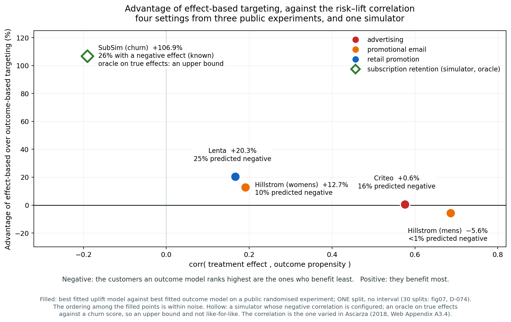

# RetainIQ

[](https://github.com/PrashamJ17/PBL-Proj/actions/workflows/ci.yml)
[](https://www.python.org/downloads/)
[](LICENSE)
[](https://doi.org/10.5281/zenodo.22025879)
[](https://doi.org/10.5281/zenodo.22025123)

**Causal retention decisioning for small subscription businesses.**

Research software for the paper **[When Does Uplift Modelling Pay? A Correlation Criterion
and a Measurement Floor for Small-Scale Subscription
Retention](https://doi.org/10.5281/zenodo.22009470)**.

Uplift modelling — targeting customers by estimated treatment effect rather than by
predicted churn risk — is widely recommended and inconsistently useful. This repository
contains evidence on *when* it pays, *by how much*, and *at what scale it stops being
measurable at all*.

---

## The three results

**1. Where the risk–lift correlation is high, an uplift model does not beat a plain outcome model.**

The quantity is not ours. Ascarza (2018, Web Appendix A3.4) sets the correlation between a
customer's churn risk and their response to an offer in a simulation, shows how the two
rankings and the effect by risk decile change with it, and places her two field studies at
about +0.2 and −0.2. What this repository does is **measure** it from fitted models:
`corr(τ̂, π̂)`, the correlation across customers between estimated treatment effect and
estimated outcome propensity, on four settings from three public randomised experiments
and on one calibrated simulator.

| Setting | corr(τ̂, π̂) | Advantage of uplift |
|---|---:|---:|
| Hillstrom — mens arm | +0.69 | **−5.6%** |
| Criteo-UPLIFT v2.1 | +0.58 | +0.6% |
| Hillstrom — womens arm | +0.19 | +12.7% |
| Lenta | +0.17 | +20.3% |
| SubSim — subscription churn | −0.19 | **+106.9%** |

Read the table with three cautions (D-068):

- **The four real rows are not retention data.** They are an email promotion, an
  advertising campaign and a retail promotion. Where the correlation is high the uplift
  model gains nothing (Criteo) or loses (Hillstrom men), because the outcome model ranks
  nearly the same customers from an easier estimate. The ordering among these four rows
  is within noise.
- **The SubSim row is not measured the same way.** It uses the simulator's *true* effects
  and compares the *oracle* with a churn score. The real rows compare an estimated uplift
  model with an estimated outcome model, on one seed and one split. Part of the gap
  between the last row and the rest is that difference.
- **SubSim's negative correlation is an assumption.** The simulator is configured so that
  the customers a churn model ranks highest include dormant payers for whom *being
  contacted is itself the reminder to cancel*. Field evidence that a retention contact
  can raise churn exists (Ascarza, Iyengar & Schleicher 2016; Ascarza 2018, Study 2).
  This repository adds none.

Lenta was an out-of-sample prediction, registered before the data was obtained, and it
landed, though the test is underpowered (D-031).



*Filled points are fitted models on real experiments. The hollow point is the simulator's
oracle on true effects: an upper bound, not a like-for-like measurement.*

**2. At the scale of the businesses this most concerns, neither method is reliable.**

Holding the evaluation set fixed and shrinking only the training set on a real
64,000-customer experiment, the best effect-based method beats random targeting on **75%
of draws at n = 500**. One standard estimator manages 55%. Mean performance at that size
looks respectable — but a business gets one draw, so we report win rate, not mean (D-023).

**3. A small business cannot measure its own retention campaigns.**

The holdout incrementality estimator is unbiased — it recovers the simulator's known
effect with bias centred on zero and 88–98% interval coverage. Its **minimum detectable
effect still exceeds the delivered effect at every business size tested, including
10,000 customers**. Detecting an effect of 0.0108 at 80% power with a 10% holdout needs
roughly **119,500 customers** (D-065).


---

## The founding experiment

A retention campaign targeted by churn score **loses money**, and loses *more than
targeting at random*. Verified 6/6 seeds against a real gradient-boosted churn model
(holdout AUC 0.700) trained on observables under a strictly temporal split.

At a 20% budget on a 3,589-customer eligible base:

| Policy | Treated | Expected value | Harmed |
|---|---:|---:|---:|
| do nothing | 0 | 0 | 0 |
| treat everyone | 3,589 | −89,869 | 44 |
| random 20% | 718 | −17,035 | 9 |
| **churn-score top 20%** | 718 | **−22,823** | 18 |
| oracle uplift top 20% | 718 | +5,877 | 0 |
| **oracle uplift with abstention** | **209** | **+8,610** | **0** |

1. **A churn score is anti-informative for targeting.** Random targeting is merely
   uninformed; a churn score actively sorts *toward* the customers an offer harms.
   Sleeping dogs are **59.1%** of the top predicted-risk decile against **5.3%** of the
   bottom, on a population that is 25.7% sleeping dogs overall.
2. **Abstention beats ranking.** Treating 209 customers earns more than treating 718.
3. **Improving churn-model AUC can worsen business outcomes** under top-*k* targeting.
   The better the model gets at its own job, the more precisely it finds sleeping dogs.

The setup is deliberately adverse to the thesis: the offer's *average* effect is
beneficial (mean τ = −0.0101, enforced by a calibration gate), so every unit of value lost
is attributable to targeting rather than to a bad offer.

> **Scope.** Worse-than-random did **not** replicate on the real RCTs, and the claim is
> scoped accordingly (D-020). It holds in the simulator, where the risk–lift correlation is
> negative by construction. Neither that condition nor the harm is new here; both are in
> Ascarza (2018). See *Relation to prior work*, next.

---

## Relation to prior work

Four papers cover most of the ground this project stands on. `docs/DECISIONS.md` D-068
records what each establishes and which earlier claims of ours it withdraws.

| Paper | Establishes |
|---|---|
| Ascarza (2018), *Journal of Marketing Research* 55(1):80–98 | Targeting by effect beats targeting by risk in two field experiments; in one, risk targeting raises churn. Web Appendix A3.4 simulates the risk–lift correlation. Leaves the size of the pilot open. |
| Ascarza, Iyengar & Schleicher (2016), *Journal of Marketing Research* 53(1):46–60 | A retention campaign raised churn from 6.4% to 10.0% in a randomised experiment on 64,147 customers. |
| Lemmens & Gupta (2020), *Marketing Science* 39(5):956–973 | Targeting on expected profit lift, with the campaign size chosen on held-out data. |
| Devriendt, Berrevoets & Verbeke (2021), *Information Sciences* 548:497–515 | Uplift against churn models on a 200,903-customer bank dataset, scored in profit. |

**Not ours:** that churn scores point at the wrong customers, that risk targeting can do
harm, the risk–lift correlation as the explanation, and scoring a policy in money.

**What this repository adds:** how the methods behave on a pilot of a few hundred
customers (result 2); the gap between the effect a small business can deliver and the
effect it can detect (result 3); the correlation measured on public experiments,
including settings where uplift loses (result 1); and an uncertainty threshold that was
implemented and did not beat doing nothing (D-054; see *What did not work*).

**Not yet done:** Lemmens & Gupta's cutoff rule is not a baseline in any experiment here,
and the correlation table has the measurement gaps listed under result 1.

---

## What did not work

This section is not modesty. Reporting only the wins would misrepresent what the evidence
supports, and three of these are the most useful things the project learned.

- **A units error survived 337 passing tests (D-057).** The abstention rule multiplied a
  log-odds τ by customer value as if it were a probability difference, inflating benefit
  by `1/(p₀(1−p₀))` — worst exactly for low-risk customers, which is the Sure Thing error
  reproduced inside our own decision rule. Every test passed because every test was a
  self-consistency check, and a units error is self-consistent. The fix makes the bug
  unrepresentable: `policy/economics.py` accepts money only.
- **The Phase 4 gate was unpassable as written (D-055/056).** Break-even |τ| is 0.040
  against a mean of 0.010, so an *oracle* treats only 5.8% of customers. Detectability and
  profitability move in opposite directions across the offer ladder. A minimax-regret
  reading was pre-registered and then **refuted** out of sample.
- **Per-customer offer optimisation does not beat one well-chosen offer (D-058).** It wins
  on 58% of draws, CI [0.42, 0.72] — indistinguishable from chance. A hindsight-uniform
  rung captures 73% of oracle value against the optimiser's 28%. **Choosing the offer
  beats choosing the customer.**
- **Two of five pre-registered predictions failed** after the D-057 fix. Recorded as
  failures rather than quietly dropped.

Every design decision, including the adverse ones, is in
[`docs/DECISIONS.md`](docs/DECISIONS.md) (D-001 … D-068). It is append-only.

---

## Quickstart

```bash
git clone https://github.com/PrashamJ17/PBL-Proj.git
cd PBL-Proj
make install     # or: pip install -e ".[dev,viz]"
make check       # lint + 558 tests + calibration gates
```

```python
from retainiq.sim import simulate, SimConfig
from retainiq.experiments.kill_test import run

sim = simulate(SimConfig(n_customers=6000, n_months=24, seed=7))
results, per_customer, auc = run(sim, decision_month=6, budget_fraction=0.20)

for r in results:
    print(f"{r.name:<32} {r.expected_value:>12,.0f}")
```

Phase 0 depends on numpy, pandas and scipy only. Heavier libraries are optional extras, so
the founding result can be reproduced on a machine with no ML stack installed.

---

## Reproducing the paper

Every number in the paper comes from one of these commands.

| Command | Produces |
|---|---|
| `make killtest` | The founding experiment (Table 1) |
| `make survival` | Survival head-to-head vs Cox / RSF / DeepSurv (Tables 6–7) |
| `make clv` | Customer value and the leak split by cause |
| `make abstention` | Phase 4 gate — abstention against ranking |
| `make sensitivity` | Why that gate failed — effect size and offer cost (D-055/056) |
| `make ladder` | Phase 5 gate — rung matching against one good offer (D-058) |
| `make ai-channels` | Break-even salience for automated outreach (D-064) |
| `make holdout` | The measurement floor (D-065) |
| `make figures` | Regenerate all six figures |
| `make zenodo` | Rebuild the archived data record byte-for-byte |
| `make help` | Everything else |

Survival baselines need `make install-survival` first (adds Cox, RSF and DeepSurv).

**Data.** The five third-party datasets are cited, not redistributed — they carry their
own terms. The loaders fetch them from canonical sources, and
[the data record](https://doi.org/10.5281/zenodo.22025123) publishes a SHA-256 for the
exact file used for each, so you can verify byte-for-byte that you have what we had.

---

## Why SubSim exists

Real data never contains the counterfactual. You observe what happened to the customer you
treated, never what would have happened had you left them alone. An uplift model evaluated
on real data can therefore only be scored on group-level proxies — Qini, AUUC — which
assume you rank and treat the top *k*.

SubSim knows both potential outcomes exactly, under common random numbers, so estimators
can be scored against **true individual treatment effects** and policies evaluated on
**realised net value under a budget constraint** — the question a business actually pays to
have answered.

Two guards keep it a test bench rather than an answer key, both enforced in CI:

- no latent trait may appear in the observable panel;
- no single observable may correlate with `attention` above r = 0.95 — otherwise spotting
  sleeping dogs would be trivial and the simulator would have assumed away the problem it
  exists to pose.

Calibrated against published SMB-SaaS benchmarks (4.5% monthly voluntary churn, 30%
involuntary share, flattening retention curve) and verified stable across seeds. The
hazard intercept is **solved for by bisection**, never hand-tuned.

A fixed seeded draw is archived at
[doi.org/10.5281/zenodo.22025123](https://doi.org/10.5281/zenodo.22025123): panels,
customer summaries and ground-truth counterfactuals at n = 500 / 2,000 / 10,000, plus
ground-truth effects for all six offer rungs on a common 2,000 customers.

---

## Repository layout

```
retainiq/
├── core/         Canonical schema (occurred_at + available_at on every fact),
│                 point-in-time feature store, leakage audit with canary injection.
├── sim/          SubSim — latents via copula, one hazard definition, exact ground-truth
│                 τ under common random numbers, offer ladder, dunning, calibration solver.
├── ingest/       Stripe · CSV (table-aware alias resolution) · preflight safety check ·
│                 SubSim adapter.
├── models/
│   ├── survival/ Discrete-time person-period hazard with competing risks; KM, IPCW Brier
│   │             and D-calibration in numpy; Cox / RSF / DeepSurv baselines (optional).
│   ├── uplift/   Hierarchical Bayesian CATE (Laplace posterior, validated vs NUTS) and
│   │             the money-denominated abstention rule.
│   └── clv/      Customer value, value at risk, exact shortfall by cause.
├── policy/       Dunning retry policies · economics (log-odds → money, D-057) ·
│                 offer ladder · holdout assignment, ledger and incrementality.
├── report/       Churn Autopsy · reason codes (exact, not SHAP) · worklists · dashboard.
├── benchmarks/   Hillstrom · Criteo · Lenta · Telco · GBSG2 loaders and evaluation.
├── experiments/  Every experiment in the paper, one module each.
└── cli.py        preflight and autopsy — argparse only, no runtime dependency.

tests/            558 tests — fairness, realism, edge cases, leakage gates
docs/
├── BUILDLOG.md   what was built, what was tested, what happened
└── DECISIONS.md  why each choice was made (D-001 … D-065), append-only
explainer/        10 documents for non-technical readers
papers/           RESEARCH_PAPER.md and the six figures
```

CI runs on every push across Python 3.11–3.13 and gates on four things: the test suite,
the calibration targets, the **leakage suite**, and the **kill test**. If the founding
claim ever stops holding, the build fails.

---

## Invariants

Breaking any of these invalidates results, so they are enforced in code and CI rather than
documented and hoped for. The full list is in [`CLAUDE.md`](CLAUDE.md); the load-bearing
ones:

1. **Temporal splits only.** Train on months < T, predict at T. Public datasets with no
   calendar time are split by subject, and said so explicitly.
2. **Latents never enter the observable panel.** CI-enforced.
3. **Every fact carries `occurred_at` and `available_at`.** Features filter on
   availability; `FeatureStore._visible` is the only path to source data.
4. **Any split of a person-period frame is by subject, never by row.**
5. **Never extrapolate past observed support.** Both `clv()` and `survival()` raise;
   `allow_extrapolation=True` makes the assumption a visible line of code.
6. **Value is measured against doing nothing**, never save-rate-among-treated.

---

## Status

Phases 0–5 are built; Phase 6's infrastructure is built and validated. The two open gates
are commercial, not technical — they need a business, not more modelling.

| Phase | | Gate | |
|---|---|---|---|
| 0 | Simulator + kill test | churn-score targeting provably loses money | ✅ |
| 1 | Schema, point-in-time features, ingest | leakage suite green in CI | ✅ |
| 2 | Dunning + retry timing + CLI delivery | first paying client | 🟨 open |
| 3 | Survival hazard + CLV | beats Cox and RSF 10/10 on Telco, ties DeepSurv | ✅ |
| 4 | Hierarchical Bayesian CATE + abstention | beats ranking 93%, not do-nothing | 🟨 partial |
| 5 | Offer ladder + reason codes + dashboard | owner can act unaided | ✅ |
| 6 | Holdout infra + incrementality | a real client ROI number | 🟨 open |
| 7 | Cross-tenant priors, BTYD router | tenant #10 beats tenant #1 on day 1 | ⬜ |

Phase 4's gate is reported as **partial** rather than met. Phase 5's optimiser is reported
as **not beating an achievable rival**. Neither was tuned until it passed.

---

## Citing

Please cite the paper rather than the code:

```bibtex
@article{jain2026uplift,
  title  = {When Does Uplift Modelling Pay? A Correlation Criterion and a
            Measurement Floor for Small-Scale Subscription Retention},
  author = {Jain, Prasham and Gupta, Rishi},
  year   = {2026},
  doi    = {10.5281/zenodo.22009470}
}
```

Software: [10.5281/zenodo.22025879](https://doi.org/10.5281/zenodo.22025879) ·
Data: [10.5281/zenodo.22025123](https://doi.org/10.5281/zenodo.22025123)

Department of Computer Science and Engineering, Manipal University Jaipur.

---

## Licence

Apache License 2.0 — see [LICENSE](LICENSE). The archived data record is CC BY 4.0. The
third-party datasets remain under their own terms and are not redistributed here.
