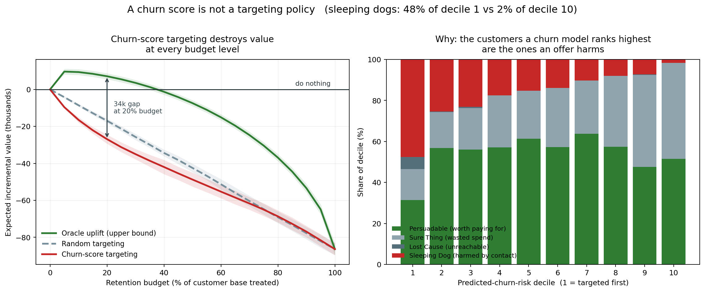
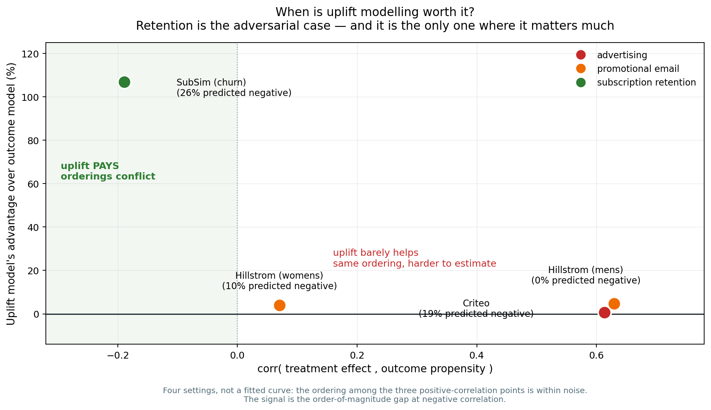

# 05 — The evidence

*Assumes [03](03-the-core-insight.md).*

**Read the honest-status section at the end before drawing conclusions.**

---

## What we set out to disprove

Before building a company on the claim in [03](03-the-core-insight.md), we tried to kill
it. The test was defined in advance, with a specific failure condition:

> *If a churn-score-targeted retention campaign does **not** lose money, the thesis is
> wrong and we stop.*

Setting a kill condition beforehand matters. It is the difference between running an
experiment and looking for confirmation.

---

## The obstacle: real data cannot answer this question

To know whether contacting a customer helped, you need two facts:

1. what happened when you contacted them, **and**
2. what would have happened if you hadn't

**You can never observe both.** You did one or the other. This is the fundamental
problem of cause and effect, and it means no real dataset in existence can score this
kind of model at the individual level.

So we built a simulated subscription business where we control the underlying reality
and therefore know **both answers for every customer**. This is a standard and accepted
approach — but it only means anything if the simulation is realistic, which is where
most such work is weak.

---

## Making the simulation trustworthy

A simulator you tune until it agrees with you proves nothing. Four safeguards:

**1. Calibrated against published industry benchmarks, not to taste.** Targets were set
from published 2026 small-business software benchmarks *before* tuning:

| What | Our simulation | Published benchmark |
|---|---|---|
| Monthly voluntary churn | 4.5% | 3–7% |
| Failed payments as a share of all churn | 30% | 20–40% |
| Customers remaining after 2 years | 23% | 22–50% |
| Early churn vs later churn | 2.0× | Should exceed 1× |

**2. Key settings are solved for, never hand-picked.** The main parameter controlling
churn rate is found automatically by a search routine targeting the benchmark. Nobody
adjusted it by eye until results looked good.

**3. Checked across eight independent random variations.** A simulator that only works on
one lucky draw is not calibrated. All figures held steady.

**4. The models are not allowed to cheat.** The simulation knows hidden facts about each
customer — their true attentiveness, their true price sensitivity. Our models are given
*none* of it; they see only what a real business could see. Two automated tests enforce
this on every code change, one of which checks that no observable signal reveals the
hidden "attentiveness" trait too precisely — because if it did, spotting sleeping dogs
would be trivial and we would have assumed away the very problem we are studying.

---

## We deliberately made our own claim harder to prove

This is the part we would most like an evaluator to scrutinise, because it is where
dishonest work hides.

**Our first result was too good, so we rejected it.**

The initial settings produced 30% sleeping dogs and — importantly — meant that
contacting customers **increased churn on average**. Under those conditions, of course
badly targeted campaigns lose money. The offer itself was harmful.

That result was not credible. Published work treats sleeping dogs as a *minority*
segment, and any competent reviewer would conclude we had tuned the simulation to
flatter ourselves.

So we changed it. Sleeping dogs were reduced to **17%**, and the settings now ensure the
average effect of contacting a customer is **beneficial** — a blanket campaign to
everyone *helps* on average.

This makes our claim much harder to demonstrate. Any money lost is now attributable
**purely to bad targeting**, not to a bad offer.

**The result survived.** We then locked this in as an automated check that fails the
build if the average effect ever becomes harmful again.

**We also refused to use a weak opponent.** The churn model in this comparison is a real,
modern gradient-boosting model, trained properly with a strict time-based split, reaching
an accuracy score of about 0.70 — respectable by published standards. We are not claiming
churn models are inaccurate. We are claiming that **even an accurate one is the wrong
tool for this decision**.

---

## The result



A business of 6,000 customers; 3,589 eligible at the decision point; budget to contact
20% of them.

| Strategy | Contacted | Money earned or lost | Customers harmed |
|---|---:|---:|---:|
| Do nothing | 0 | 0 | 0 |
| Contact everyone | 3,589 | **−89,869** | 44 |
| Contact a random 20% | 718 | −17,035 | 9 |
| **Contact highest-churn-risk 20%** | 718 | **−22,123** | 19 |
| Contact the truly persuadable 20% | 718 | +5,877 | 0 |
| **Contact only where it's worth it** | **209** | **+8,610** | **0** |

Repeated across six independent random variations, the outcome was unanimous:

- churn-score targeting **lost money — 6 times out of 6**
- churn-score targeting was **worse than random — 6 times out of 6**
- selective targeting with abstention was **profitable — 6 times out of 6**

---

## What the picture shows

**Left panel — the outcome.** Money earned against how many customers you contact. The
red line is the industry-standard approach. It is below zero everywhere, and below the
grey random line everywhere. Shaded bands show variation across runs; they do not
overlap.

Note the green line **peaks and then falls**. Even a perfect method loses money if you
force it to spend more. There is a right amount of intervention and it is smaller than
anyone assumes. All lines meet at the far right, where every strategy contacts everyone
and they become the same strategy.

**Right panel — the mechanism, and the real finding.** Customers sorted into ten groups
by predicted risk, coloured by what they truly are.

Look at group 1 — the people you contact first. **Red is 48% of that bar.** Nearly half
of the customers at the top of the list are people an offer will drive away. In group
10, the ones you never contact, red is 2%.

**The churn model is not failing. It is working exactly as designed, and being
diligently wrong.** The trait that makes someone likely to leave — disengagement — is the
same trait that makes contacting them dangerous.

---

## Three findings worth stating separately

**1. A churn score is worse than nothing for this decision — where sleeping dogs exist.**
Random targeting is uninformed; it meets sleeping dogs at their natural 17% rate. A churn
score is *anti-informed* — it seeks them out. **The scope condition matters**: this
requires a harmed group that resembles the people the model ranks highest. The real-data
test below shows what happens when no such group exists.

**2. Knowing when to stop is worth more than knowing how to rank.**
Contacting **209** customers earned **more** than contacting **718**. The extra 509
contacts destroyed value. Restraint outperformed better ranking.

**3. Improving your churn model can reduce your profit.**
The better a model gets at detecting disengagement, the more precisely it finds sleeping
dogs. Teams optimising accuracy may be actively making their business worse — which
explains why this problem has persisted despite enormous industry attention.

---

## The real-data test — where the claim held, and where it broke

Everything above comes from our simulation. The obvious objection is that we built the
simulation, so of course it agrees with us. So we tested the claim against **real
experimental data**: the Hillstrom email experiment, 64,000 customers randomly assigned
to receive a marketing email or nothing, with their subsequent behaviour recorded.

Because assignment was random, the untreated group is a genuine control. This is real
evidence, not our own construction.

**Before running it, we wrote down what we expected** — in the code, committed in
advance. Specifically: that this is email marketing rather than subscription retention,
that its potential for harm is much weaker, and that our "worse than random" finding
**might well fail there**. Recording that first is the only reason our reading of the
result afterwards is trustworthy rather than convenient.

### What happened

| Targeting method | Extra visits generated |
|---|---:|
| Contact everyone | 933 |
| **Best uplift method** | **467** (from 30% of contacts) |
| Standard outcome-model targeting | 416 |
| Random targeting | 281 |

Two findings, one confirming and one correcting:

**Confirmed:** uplift-based targeting beat outcome-based targeting, and both beat
random.

**Not confirmed:** outcome-model targeting was **better** than random here, not worse.

### Why it broke — and why that is useful

We investigated rather than explained it away. Sorting customers by how much the model
thought the email would help them, then checking what *actually* happened to each group:

**Every single group benefited from the email.** Even the customers predicted to respond
worst still visited more often when emailed. In the men's campaign, only 0.2% of
customers were predicted to be harmed at all.

**Hillstrom has no sleeping dogs.** There is nobody the email drives away. And when a
treatment helps everyone, targeting the most responsive people naturally beats picking at
random — being harmful is not merely unlikely, it is *structurally impossible*.

### The corrected claim

> Standard targeting is worse than random **when a group exists that the intervention
> actively harms, and that group looks like the people the model ranks highest**. That
> is the situation in subscription retention — you remind a dormant customer they are
> paying you. It is not the situation in promotional email, where an unwanted message is
> at worst ignored.

This is narrower than what we claimed before, and considerably more defensible. It also
explains why our simulator was necessary rather than merely convenient: **no public
dataset contains the mechanism**, so the only way to study it was to build a setting
where it exists and is measurable.

---

## Two more real datasets, and the rule that explains all of them

We then tested two further real experiments: **Criteo** (14 million people, online
advertising) and **Lenta** (687,000 supermarket customers, promotional text messages).

Criteo gave the opposite answer to Hillstrom. Targeting by *effect* — the approach we
argue for — was no better than targeting by *likelihood of responding*. Every method was
tied.

Two real datasets, two contradictory answers. Neither was a fluke, and the explanation
is the most useful thing in this project.

### The rule

Two different questions can be asked about a customer:

- **How likely are they to respond?** (what a conventional model estimates)
- **How much does contacting them change what they do?** (what actually matters)

Sometimes those two questions rank customers in the *same order*. When they do, the
conventional model wins — not because it is asking the right question, but because it is
asking an **easier** one. Estimating one quantity is more stable than estimating the
difference between two, and with limited data that reliability advantage decides it.

Sometimes the two orderings *conflict*. That is when the conventional approach stops
being merely wasteful and starts actively selecting the customers you will harm.



Each point is one setting. The horizontal axis measures how closely the two orderings
agree. The vertical axis is how much better the effect-based approach does.

Everything on the right — advertising, promotional email, retail texts — sits near zero.
The orderings agree there, so the sophisticated approach buys almost nothing. Only
subscription retention sits on the left, and it is an order of magnitude above the rest.

### Why this made the argument stronger, not weaker

It replaced *"this approach is better"* — which is **false in advertising, and we can
prove it** — with something narrower and testable: **subscription retention has a
structure that advertising does not.**

It also produced a prediction we could get wrong. Before downloading Lenta, we wrote down
that retail promotion should land *between* advertising and subscription retention. It
landed at +0.18, between +0.61 and −0.19, as predicted.

One caveat we state plainly, and the figure states on its face: with five settings this
is a contrast, not a curve. The ordering among the four points on the right is within
noise. The finding is the gap on the left.

---

## The finding that matters most, and it is from real data

Hillstrom cannot test the harm mechanism. But it can test the question this project
actually exists to answer: **does any of this work when a business is small?**

We shrank the amount of data the models could learn from — from 20,000 customers down to
500 — while keeping the evaluation identical, so any difference is caused by scarcity
alone. We repeated it across twenty different random splits.


The left panel is how this is normally reported: average performance improves with more
data. Unremarkable.

**The right panel is the finding.** It asks a different question: *on what fraction of
attempts did the method actually beat random?* A business does not get an average across
twenty parallel universes. It gets one attempt.

| Customers to learn from | Best method beats random |
|---|---|
| 500 | **75% of the time** |
| 1,000 | 90% |
| 2,000 | 100% |
| 5,000+ | 100% |

At 500 customers, the best method fails to beat random **one time in four**. One
estimator managed only 55% — a coin flip. Yet its *average* performance looks perfectly
respectable, which is exactly how a business ends up deploying something that does
nothing.

**Reliability arrives at roughly 2,000 customers.** Below that, deploying a conventional
uplift model is closer to a gamble than a decision — and below that is precisely where
the businesses we care about live.

This is the strongest argument yet for the part of our approach nobody else builds:
**when the evidence is too thin to know whether acting will help, say so and do
nothing.** And unlike everything else in this document, it rests on real experimental
data rather than our own simulation.


## How thoroughly this is checked

**58 automated tests**, all passing, run on every change. Beyond ordinary correctness:

- **Fairness tests** — no hidden fact may leak into what models can see.
- **Direction tests** — with the harm mechanism switched off, sleeping dogs must be
  *impossible*; with the helping mechanism off, persuadables must be impossible. This
  pins down that the two forces are wired up correctly.
- **Edge cases** — zero customers, one customer, zero months, extreme settings at both
  limits, and the small-business case of 300 customers.
- **Economic sanity** — the "do nothing" baseline must be exactly zero; contacting only
  worthwhile customers must never lose money and must never select a sleeping dog.

One test failure is worth reporting because it corrected *us*: we had asserted that
switching off voluntary churn entirely would mean nobody leaves. It failed — customers
still left through **failed payments**, an entirely independent process. Our code was
right and our assumption was wrong. That test now positively verifies the separation of
the two kinds of churn.

---

## Honest status — please read this

**What we have proven:**

- In a benchmark-calibrated simulation, under settings chosen to make our claim harder
  rather than easier, the standard approach to retention targeting loses money and
  performs worse than random — **given a population containing sleeping dogs**.
- On **real randomised data**, uplift-based targeting beats outcome-based targeting.
- On **real randomised data**, conventional uplift methods are **unreliable below about
  2,000 customers** — beating random on only 75% of attempts at n=500. This is the
  strongest support for our abstention approach and it does not come from our own
  simulation.

**What we have NOT proven:**

- **The worse-than-random result did not replicate on real email-campaign data**, because
  that dataset contains no harmed customers at all. The claim is therefore *conditional*
  on a mechanism we have demonstrated only in simulation. We believe it applies to
  subscription retention on well-understood grounds, but we have not shown it on real
  subscription data — and no public dataset exists that could.
- **Nothing has been validated on a real business.** No paying customers yet.
- The real-world share of sleeping dogs is uncertain. We used 17% based on published
  literature. If the true figure is far lower in a given business, the effect shrinks —
  though the *direction* of the argument holds at any non-zero level.
- **The core idea is not new.** Eva Ascarza (*Journal of Marketing Research*, 2018)
  established with field experiments that targeting the highest-risk customers is
  ineffective, and that targeting on responsiveness works better. Our contribution is
  characterising **when risk-based targeting becomes actively harmful rather than merely
  ineffective**, and making the method work at small scale.
- The comparison above uses a **perfect-knowledge** version of our method as the upper
  bound. Building a real method that approaches it, from limited data, is the actual
  research problem and is not yet solved. That is Phase 4.
- Our simulation's forward-looking window is slightly less random than reality, which
  marginally understates variability. This is disclosed in our technical notes.

**The correct summary:** we have strong evidence that the industry standard is broken and
that a better approach exists in principle. We have not yet built the practical version,
and we have not yet earned anyone real money.

[Document 09](09-status-and-roadmap.md) states precisely what is complete.
[Document 07](07-risks-and-limitations.md) states what could still go wrong.

---

## Reproducing this yourself

Everything is open and runs in under a minute on a laptop:

```bash
pip install -e .
python -m pytest tests/ -q            # 58 tests
python -m retainiq.experiments.figures    # regenerates the figure above
```

---

**Next:** [06 — The business case](06-the-business-case.md).
