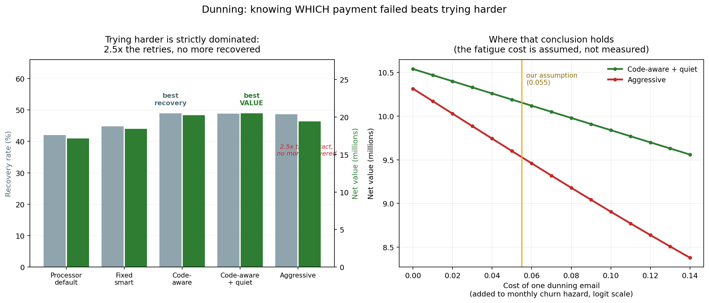

# 09 — Status and roadmap

**This document is updated as the project progresses. Everything else in this folder is
relatively stable; this is the living record.**

**Last updated:** Phase 5 complete (the decision engine, plain-language explanations and
the dashboard), a serious bug found and fixed in our own decision rule, and the diagnostic
made deliverable against real Stripe and Razorpay exports. Still nothing sold.

---

## Where we are in one line

**The founding claim has been tested and survived; the data plumbing that keeps future
results honest is built; we can put a figure on each customer and on how much of it is at
risk; our decision method reliably beats the standard approach without yet beating doing
nothing; and a business can now send us two spreadsheets and get a report back. Nothing
has been sold to a real customer yet, and that is the only thing still in the way.**

---

## What is actually done

| | Status | Evidence |
|---|---|---|
| **The core claim tested** | ✅ Done | Standard approach loses money, 6/6 runs — [05](05-the-evidence.md) |
| **Realistic business simulator** | ✅ Done | Calibrated to published benchmarks, stable across 8 variations |
| **Connecting to real billing data** | ✅ Done | Stripe and CSV adapters; one common data shape |
| **Guard against using future information** | ✅ Done | Measured: prevents a 0.35 inflation in apparent accuracy |
| **Failed-payment recovery** | ✅ Built | Better-timed retries recover 6.9 percentage points more, using a third fewer attempts — see [below](#what-phase-2-found-about-failed-payments) |
| **A report a business can actually receive** | ✅ Built | Two spreadsheet exports in, one web page out — tested against real Stripe and Razorpay formats |
| **Predicting when a customer leaves, and what they are worth** | ✅ Done | Matches or beats established methods on public data — see below |
| **Quality controls** | ✅ Done | 414 automated tests, all passing |
| **Written record** | ✅ Done | Every decision and its reasoning documented |
| **The practical version of our method** | 🟨 Built | Beats the standard approach on 93% of runs; does **not** yet beat doing nothing — [see below](#what-phase-4-was-about-and-what-it-honestly-found) |
| **Customer-facing product** | 🟨 Built | Decision engine, plain-language reasons, and a dashboard an owner can act from — not yet in anyone's hands |
| Proof with a real business | ⬜ Not started | — |
| Paying customers | ⬜ **None** | — |

**Eleven rows of thirteen.** But note *which* eleven: all of it is groundwork, evidence
or machinery, and two of those rows are complete only in the sense that they were built,
tested and found wanting. **Nothing yet has earned anyone money**, and the two rows that
would prove the idea works outside our own machinery are both still empty. Those two are
now the entire remaining risk.

---

## What Phase 1 was about, in plain terms

There is a failure mode in this field that ruins projects quietly. A model is
accidentally given information that would not have existed at the moment it had to make
its prediction — for example, counting a customer's activity across their *whole*
history, including months after the decision point. The model then looks superb in
testing and fails completely in real use.

It is dangerous precisely because it makes results look **better**. Nobody investigates
a number that improved.

Phase 1 built machinery that makes this structurally impossible, and then **measured
what it is worth**. The same features, computed correctly and incorrectly:

| how the features were built | apparent accuracy |
|---|---|
| Correctly | **0.60** |
| Ignoring reporting delays (subtle error) | 0.61 |
| With no time filter at all (common error) | **0.95** |

That 0.95 is a mirage. A business shown that number would reasonably conclude the
system works almost perfectly, and would allocate a retention budget accordingly.

We also built the connections to real billing systems, so the work from here runs on the
same data shape a real customer would provide.

---

## What Phase 2 found about failed payments

Around a third of the customers a subscription business loses never decided to leave —
their card failed. The intuitive response is to try harder: retry more often, email more
insistently.

That turns out to be **strictly worse**. The aggressive approach on the left uses two and
a half times as many retries and nearly four times as many emails, and recovers *no more
money*. What works is knowing *which* failure you are looking at: money that has not
arrived yet needs a retry timed to payday, and an expired card cannot be charged again no
matter how many times you try.

The right panel is there because the conclusion depends on something we assumed rather
than measured — how much goodwill one payment-failure email costs. It shows the point at
which the answer would flip, so a reader can judge whether our assumption is reasonable
instead of taking it on trust.

---

## What Phase 3 was about, in plain terms

Everything before this phase talked about customers in terms of **probability** — this
one is 30% likely to leave, that one 8%. A business does not spend probability. It
spends money, and the two customers might be worth £12 and £1,200.

Phase 3 built two things.

**A model of *when* a customer leaves, not just whether.** Instead of predicting "will
they churn this year", it predicts the chance of leaving in each individual month, given
what we know about them right now. Chaining those months together gives a full survival
curve: the chance they are still paying in month 1, month 2, and so on.

Two properties matter more than accuracy here:

- It handles information that **changes over time**. A customer whose usage collapsed
  last month is a different customer from the one who signed up. Most standard methods
  can only use what was true on the day someone joined.
- It keeps **voluntary leaving separate from failed payments**. Someone whose card
  expires has not decided anything. Merging the two — which nearly every published churn
  model does — makes roughly a third of the problem invisible to the model meant to
  explain it.

**Lifetime value.** Multiply each month's chance of still being a customer by the profit
that month, discount it because money later is worth less than money now, and add it up.

We deliberately **refuse to extend that sum past the data we actually have**. The usual
industry shortcut ("average revenue divided by churn rate") quietly assumes customers
leave at a constant rate forever. They do not — long-tenured customers leave more slowly
— so the shortcut is not just uncertain, it is wrong in a predictable direction. Our code
raises an error rather than producing a comfortable number.

### The result worth remembering

On simulated data where we know the truth, we ranked customers two ways: by **chance of
leaving**, and by **money at risk** (value multiplied by that chance).

**The two top-10% lists overlapped by only 21%.**

Put plainly: a churn score points you at the wrong four-fifths of the money. And this is
before any of the harder argument in [03](03-the-core-insight.md) about *contacting*
people making things worse — it is simply that a risk score does not know who is
valuable.

### How it compares to the established methods

We tested against the three standard approaches (Cox regression, random survival
forests, and a neural-network method called DeepSurv) on **Telco**, a public dataset of
7,032 real subscription customers.

| | Ranking customers correctly | Are the probabilities honest? |
|---|---|---|
| **Ours** | joint best | **best, tied with DeepSurv** |
| DeepSurv | joint best | **best, tied with ours** |
| Cox regression | slightly worse | clearly worse |
| Random survival forest | worse | clearly worse |

**We beat two of the three and tied the third**, on ten out of ten repeats. We do not
claim to have beaten DeepSurv — the difference was 0.0824 against 0.0825, which is
noise, and calling it a win would be dishonest.

The picture shows what "honest probabilities" means. The diagonal is perfect: a customer
the model says has a 30% chance of leaving should leave 30% of the time. A line above it
means the method is over-confident about who will stay. This matters more than ranking
for our purposes, because we multiply these probabilities by what each customer is worth
— and a probability that is systematically 20% too optimistic makes every value estimate
built on it 20% wrong.

We also tested on a medical dataset those methods were originally designed for, and
**we lost** — we wrote down that we expected to lose before running it, and we did. Our
approach works in whole months because subscriptions bill in whole months; that dataset
is measured in days, and rounding to months throws away detail the others keep.

So the honest summary of Phase 3 is **not** "we built a more accurate model". It is:
*equally accurate, more honest about its own probabilities, and able to represent two
things the alternatives cannot* — information that changes over time, and the split
between leaving and payment failure. DeepSurv matches the numbers, can do neither, and
requires roughly two gigabytes of machine-learning libraries to run.

### The limitation we found and did not predict

**Below about 250 customers, none of this beats simply using the company-wide average.**
There is not enough history for any model to learn an individual pattern. That is a real
constraint on who this can help, and it is stated here rather than buried.

---

## What Phase 4 was about, and what it honestly found

Phase 4 is the part of the project everything else was clearing the way for. The idea:
rather than ranking customers by who looks likely to leave and contacting the top slice,
**estimate how much each customer's mind would actually be changed by an offer, admit how
uncertain that estimate is, and decline to act when the uncertainty is too wide to justify
spending money.** We call declining to act *abstention*.

**What it achieved.** Against the ranking approach it works. It earned more money on
**93% of runs** while contacting a small fraction as many people. (That figure was 65–80%
when this section was first written; the improvement came from fixing a mistake of ours,
described under Phase 5 below, and it did not change any conclusion.) The safety mechanism
also does what it was designed to do: when we demand near-certainty before acting, the
system contacts *nobody* and leaves the money alone rather than spending it badly — which
is what it chooses on roughly three-quarters of runs.

**What it did not achieve.** It did not beat *doing nothing at all*. There is no setting
of the dial at which it turns a profit. It either loses a little, or it correctly declines
and breaks even.

We then spent a second pass asking **why**, and the answer was unflattering but simple.

**First, the arithmetic never worked.** Contacting someone with our standard offer costs
about £32. For that to pay off, the offer has to change a customer's decision by a certain
minimum amount. Our simulated offer changes it by about **a quarter of what would be
needed**. Even a hypothetical system with perfect knowledge of every customer's true
response — something no real method can have — would find only **6 customers in 100**
worth contacting. We asked our method to find profit in that 6%, using a trial of a few
hundred people. It was never going to.

**Second, we tested it with the wrong offer, and that one is our fault.** The project has
always argued that discounts should be a business's *last* resort, and we built a ladder of
cheaper things to try first — a nudge to use an unused feature, a check-in call, a pause
instead of a cancellation. Then we ran the whole evaluation on a 20% discount, the second
most expensive rung on our own ladder. A feature nudge costs about **10 pence** and is
worth doing for 69 customers in 100.

**But the cheap options fail too, for the opposite reason** — and this is the finding that
actually matters. Expensive offers produce effects big enough to *measure* but too small to
*pay for*. Cheap offers are comfortably worth doing but their effect is too small for any
method to reliably *detect* at these sample sizes. **The things you can measure aren't worth
doing, and the things worth doing you can't measure.** That squeeze, not the size of the
effect, is the real obstacle.

**A promising idea that we tested and threw away.** Partway through, the results suggested
our method might be valuable as a *hedge* — never the best choice, but never a disaster,
which is attractive when a business cannot know in advance which situation it is in. We
wrote that prediction down first and then tested it on data we had not used to come up with
it. **It failed.** Assigning offers at random turned out to hedge better. We are recording
that here rather than quietly dropping it, because an idea that only ever gets tested
against the data that inspired it is not evidence.

That failure did point at a genuine flaw. Our system uses one fixed confidence level for
every decision — it demands the same standard of proof whether being wrong costs 10 pence
or £33. That is clearly wrong, and the correction is the first job of Phase 5. We have
deliberately **not** fixed it yet: repairing a flaw in the same breath as discovering it
would mean the fix was never independently tested.

**What a reader should take from this.** The honest claim is narrower than the one we set
out to make: *given that the standard approach actively loses money, a method that reliably
declines to lose money is worth real money compared with what businesses do today.* That is
useful and it is defensible. It is **not** the same as making a profit, and we do not claim
it is.

---

## What Phase 5 was about, and the bug we found in ourselves

Phase 5 turned the method into something a business owner could actually use: decide
which offer to make to whom, explain each decision in plain English, and show it all on
one page.

### We found a serious mistake in our own work

Before building anything new, we re-read the decision rule from Phase 4. It was wrong.

The model measures how much an offer shifts someone's chance of leaving, but it reports
that shift on a **mathematical scale**, not as a plain percentage. Our rule multiplied
that scale by the customer's value as though it *were* a percentage. The two are not the
same thing, and the gap is large: on one test the rule believed contacting a customer was
worth **−£104** when the truth was **+£20**, against an offer costing £31.

Worse, the error was not uniform. It exaggerated most for customers who were **least
likely to leave** — exactly the people this entire project exists to warn against paying.
We had reproduced our own central criticism inside our own machinery.

**Every one of our automated tests passed.** They were not badly written; they were
checking that the code agreed with itself, and a units mistake agrees with itself
perfectly. The test that now catches it checks a number we worked out by hand.

We wrote down what we expected the fix to change *before* running it, because "we fixed a
bug and our results improved" is the easiest way in the world to fool yourself. **Two of
our five predictions were wrong.** The fix cut losses substantially — from −3,531 to
−1,070 in one setting — and changed **no conclusion at all**. The method still does not
beat leaving customers alone.

### What Phase 5 built

**Choosing the offer, not just the customer.** Instead of one fixed discount, the system
now picks from a ladder — a nudge, a check-in, a pause, a downgrade, a discount — using
whichever costs least while still being worth doing.

This produced the best result the project has yet had, and it is still not one we will
claim. The system made money on average for the first time, capturing about twice as much
as the realistic alternative. But it beat that alternative on only **58 runs out of 100**,
which is not distinguishable from a coin toss.

**The finding underneath it is the useful one.** We also tested what a business would do
on its own: run a small trial of each offer, pick the winner, use it for everyone. That
approach picks the genuinely best offer only **13% of the time** — barely better than
guessing at random among six — and loses money at realistic sizes. Meanwhile, simply
using one *well-chosen* offer for everybody captured nearly three-quarters of what was
theoretically available, against our system's quarter.

Put plainly: **choosing the right offer matters much more than choosing the right
customers — and it is the thing a small business is least able to work out for itself.**
That is a smaller and far more defensible product than "AI picks who to save".

**Explanations, and admitting when there aren't any.** Every recommendation now says what
it rests on: what the customer is worth, how much the offer moves them, what it costs, and
why that offer rather than the next one. When there is genuinely nothing distinctive about
a customer — which at these sample sizes is common — it says so, instead of manufacturing
three convincing-sounding reasons. Most tools in this space do the opposite.

**A dashboard that leads with what it does not know.** The page opens with a warning that
the engine beat a single well-chosen offer on 58% of tests and that this is not
distinguishable from chance, and there is no setting that turns that warning off. A
competing product we examined displays confident "SAVE NOW" instructions on top of a model
that is barely better than a coin flip. We built the inverse on purpose.

---

## The diagnostic can now actually be delivered

For six months the note in our own plan said Phase 2's remaining work was sales, not code.
That was true, and it was also hiding something: **no command existed that turned a
business's spreadsheet into a report.** The analysis only ran on our own simulated data.
The first real customer would have failed before any conversation happened.

We tested it against real export formats and it broke four times in a row — column names
with time zones in them, an ID column being read as the wrong thing, an email address
being mistaken for a customer number, and columns that real exports simply do not contain.

The most dangerous problem was none of those. **Payment systems export money in the
smallest unit** — Stripe in cents, Razorpay in paise. A plan priced at 2900 means £29.00.
Read straight, every financial figure in the report would be **100 times too large**,
including the headline number the whole engagement is sold on. Nothing further down the
line could catch it, because 100 times a plausible number is still a plausible number.

So the system now refuses. It checks the file first and **stops** if the amounts look like
cents, rather than quietly dividing by a hundred and hoping — because guessing would be
the same kind of mistake it is there to prevent. It also stops on impossible dates, on
histories too short to measure, and on exports that contain no cancellations at all. Every
assumption it has to make is printed as a question to ask the client before the report is
sent.

---

## The plan, in order

Each phase has a **gate** — a condition that must be met before moving on. Gates exist to
force early failure rather than late failure.

| Phase | What | Gate | Status |
|---|---|---|---|
| **0** | **Build the simulator; test the founding claim** | Standard approach provably loses money | ✅ **Passed** |
| **1** | **Connect to real billing data; guard against using future information** | Automated checks pass | ✅ **Passed** |
| **2** | **Failed-payment recovery** | **First paying client** | 🟨 **Built — gate still open** |
| **3** | Prediction models for who leaves and what they're worth | Beat established methods on public data | ✅ **Passed** (2 of 3 beaten, 1 tied) |
| **4** | **The practical version of our method** | Beat existing approaches on money earned, at small scale | 🟨 **Built — gate half passed** |
| **5** | Decision engine, plain-language explanations, dashboard | An owner can act without asking us | ✅ **Passed** — with a caution, below |

| **6** | Control-group infrastructure; proof-of-results reporting | **A real client's verified return** | ⬜ |
| **7** | Cross-business learning; retail support | Client #10 outperforms client #1 on day one | ⬜ |

### Why revenue comes at Phase 2, before the clever work

Failed-payment recovery is 20–40% of all churn, needs almost no sophisticated technology,
and produces money immediately. Putting it early:

- funds the research,
- earns the billing integration everything else depends on,
- and — most importantly — **generates the evidence about what interventions actually do
  that Phase 4 cannot exist without.**

This ordering is deliberate. A project that built the sophisticated method first would
have no data to fit it with.

---

## The three research papers

| # | Subject | Depends on | Status |
|---|---|---|---|
| 1 | The simulator as a shared benchmark for the research community | Phase 0 | ⬜ Ready to draft |
| 2 | **Estimating causal effects reliably with very little data** | Phase 4 | 🟨 Drafted and ready to submit — reports a partial result, honestly |
| 3 | Choosing interventions under a budget, with real client results | Phase 6 | ⬜ |

Paper 1 is writable now. Paper 2 is the one that matters, and it is gated on the hardest
technical problem in the project.

---

## Next immediate steps

1. **Get the failed-payment work in front of real businesses.** This is not a coding
   task and no further code completes it. The report described above needs to be run
   against real billing exports and shown to the people who own them.
2. **Nothing further to build until somebody uses it.** Phases 6 and 7 — proving results
   with a control group, and learning across businesses — both require a real client by
   definition. They cannot be finished, or honestly started, from a desk. Every remaining
   gate needs a person outside this project.
3. **In parallel, keep talking to businesses.** Twenty conversations with subscription
   founders will reshape this plan more than twenty more pages of it. This does not
   depend on the product existing.

---

## What would tell you this is going well

Concrete, checkable signals — in order of how much they should update your confidence:

| Signal | What it proves |
|---|---|
| Paying client from failed-payment recovery | Someone will pay us for something |
| Our method beats simple rules on **real** data at small scale | **The central research claim survives reality** |
| A client accepts a held-back control group | The business model works |
| A verified return figure from a real business | Everything |

The second row is the decisive one. Everything else is commercial execution; that row is
whether the idea is true outside a simulation.

---

## What would tell you to stop

From [07](07-risks-and-limitations.md), the falsifiable conditions:

- Real-world sleeping dogs turn out to be negligible.
- **Our method cannot beat simple rules on real data at small scale.** ← the one to watch
- A payment processor ships a competent free version.
- Clients refuse to allow control groups.

---

## Change log

Entries are appended as work completes. Older entries are never edited.

### The diagnostic becomes deliverable

Built the command that takes a business's spreadsheets and returns a report, and a safety
check that runs first. Tested against real Stripe and Razorpay export formats, which
broke it four times. The important addition is the check that **refuses** to proceed when
amounts look like cents rather than pounds — a mistake that would have put figures 100
times too large in front of a prospect. It never converts silently; it stops and asks.

Also written: a runbook and outreach drafts, including an India-specific version where
the relevant problem is failed UPI and e-NACH mandates rather than expired cards. Both
documents list, in a table, the claims we are **not** allowed to make, each tied to the
experiment that forbids it.

**414 automated tests.** The gate is unchanged — nobody has paid anything — but it can no
longer fail for a reason we control.

### Phase 5 — complete, with the evidence unchanged

Built the offer-ladder decision engine, plain-language reason codes, and a dashboard.
Found and fixed a serious units error in our own Phase 4 decision rule first; it changed
the numbers substantially and no conclusion at all. Two of five predictions written down
before the fix turned out wrong.

The system made money on average for the first time, and beat the realistic alternative
on 58 runs out of 100, which is a coin toss. The result worth keeping is that a small
business running its own trial identifies the best offer only 13% of the time.

We also compared the project against a sibling product built on real e-commerce data. Its
published accuracy figure of "1.0 — flawless" turned out to pre-date its own bug fix;
re-running its current code gives 0.543, which is worse than assuming every customer
leaves. That is an independent repeat of our own Phase 1 finding, on different data, and
it is the strongest evidence yet that the guard rails here are worth their cost.

**388 automated tests** at the end of this phase.

### Phase 4 — built; the gate is half passed

Built the decision method: estimate how much an offer would change each customer's mind,
carry the uncertainty of that estimate honestly, and decline to act when it is too wide.

**It beats the standard ranking approach on 65–80% of runs while contacting a third as
many people. It does not beat doing nothing.** Tightening the confidence requirement makes
it contact nobody at all — which is the safety mechanism working, not a bug, but it is also
not a profit.

A follow-up pass established *why*, and the reasons were unflattering. The offer we tested
with was about four times too weak to cover its own cost, so even perfect knowledge would
have justified contacting only 6 customers in 100. We had also run the test on a 20%
discount — the second most expensive option on our own ladder of interventions, despite the
project's whole argument being that discounts should come last. The cheaper options fail
too, for the opposite reason: they are worth doing but their effect is too small to detect
reliably at these sample sizes.

We also proposed, tested, and **discarded** an appealing idea — that the method's value
lies in being a hedge that is never a disaster. Assigning offers at random hedged better.
It is recorded rather than dropped, because a prediction only counts if it is tested
against data that did not inspire it.

The one clear defect it did surface: the system uses a single fixed standard of proof
regardless of whether being wrong costs pennies or tens of pounds. That is the first job
of Phase 5, and it has been left deliberately unfixed so the fix can be tested honestly.

**337 automated tests.** Most of the new ones check that this diagnostic work did *not*
quietly change the baseline it was measuring.

### Phase 3 — complete

Built the model of *when* a customer leaves and the calculation of what they are worth.
Full description above; three things belong in the permanent record.

**The comparison was fair and we said what would count as failure first.** Before
running anything, we wrote down what we expected on each dataset and what each possible
outcome would mean. We predicted we would lose on the medical dataset and win on
calibration on the subscription one. Both happened. No setting was tuned per dataset,
for our method or for any competitor — tuning one side is how a comparison becomes an
advertisement.

**We beat two of the three standard methods and tied the third.** We report the tie as
a tie. The genuine advance is not accuracy: it is that the model can use information
that changes over time, keeps voluntary leaving separate from payment failure, and
produces probabilities honest enough to multiply by money.

**Two mistakes were found in our own measuring instruments, not in the model.** Both
concerned a technical correction for customers whose outcome we never got to see. One
was wrong by about 2% — small enough to look like noise, big enough to change which
method appeared to win. The other was wrong by a factor of ten million and was caught
only because the number was absurd. Both were found by checking our arithmetic against
an independent published implementation rather than by re-reading our own code. The
lesson is recorded because it will recur: *a result can be wrong in a way that looks
entirely plausible.*

54 new automated tests (277 total).

### Phase 2 — built, but the gate is not passed

Failed-payment recovery. Roughly a fifth to two-fifths of all cancellations are not
decisions at all — a card expired, a bank declined a charge. The processor tells you
*why* it failed, and the standard retry schedule ignores that entirely.

Using the reason to choose when to retry recovers **6.9 percentage points more** while
making **32% fewer attempts**. Retrying harder recovers nothing extra: the most
aggressive schedule uses two-and-a-half times the attempts and four times the emails
for no additional recovery.

An automated check caught our own simulation flattering this result — it was allowing
expired cards to be "recovered" by retrying, which cannot happen. Fixing it made the
finding cleaner, not weaker.

We also built the **Churn Autopsy**: a business exports three spreadsheets from their
payment provider and receives a single web page explaining where their money is going,
with a figure attached to each finding. Every finding is visibly labelled either
*measured from your data* or *estimated from industry benchmarks* — including the most
persuasive one, which is an estimate. The report also states plainly what it will not
do: it refuses to name which customers to contact, because billing data cannot support
that claim and this project exists to argue against pretending otherwise.

**The gate for this phase is a paying client, and it is still open.** No further code
changes that.

86 new automated tests (223 total).

### External validation — first real-data test

Tested our central claim against a real 64,000-customer randomised email experiment
(Hillstrom, 2008) rather than our own simulation. Results in
[05](05-the-evidence.md).

**One claim was confirmed, one was corrected, and one new finding emerged.**

Confirmed: targeting by estimated *effect* beats targeting by *likelihood of responding*.

Corrected: our "worse than random" result did **not** replicate. We diagnosed why rather
than explaining it away — that dataset contains no customers whom the email harms, so
being worse than random is structurally impossible there. The claim is now stated with
its scope condition attached: it requires a harmed group resembling the people a model
ranks highest, which is a feature of subscription retention and not of promotional email.

New, and the most important result so far: **below roughly 2,000 customers, conventional
methods are unreliable.** At 500 customers the best method beats random on only 75% of
attempts; one estimator managed 55%. Average performance looks fine, which is precisely
how a small business ends up deploying something that does nothing. This is the
strongest evidence yet for our abstention approach, and it comes from real data.

### Phase 1 — complete

Built the connections to real billing systems (Stripe, and plain CSV exports for
businesses that would rather email a file than connect an account), and translated
everything into one common shape so nothing downstream needs to know where data came
from.

The substantive work was preventing a specific, quiet failure: giving a model
information that would not have existed when it had to predict. We made that
structurally impossible rather than a matter of care, then **measured what it is
worth** — computing the same features incorrectly inflated apparent accuracy from 0.60
to 0.95.

Two things worth noting about how this was verified. First, the safeguard is enforced in
a single place that all features must pass through, so a feature that bypasses it cannot
be written. Second, the leak *detector* is itself tested adversarially: we plant known
leaks and require it to catch them. A detector that has never caught anything might be
working, or might be checking nothing — there is no way to tell from a passing run.

79 new automated tests (137 total).

### Phase 0 — complete

Built a calibrated simulation of a small subscription business that, unlike real data,
contains the answer to "what would have happened if we hadn't contacted this customer?"

Tested the founding claim and **it survived under deliberately unfavourable conditions**.
Notably: our first result was *too favourable* and we rejected it, reconfiguring so that
the average effect of contacting customers is beneficial — making our own claim harder to
demonstrate. It held anyway.

Three findings emerged, one stronger than predicted:

1. Churn-score targeting is **worse than random targeting** (6/6 runs).
2. **Restraint beat ranking** — contacting 209 customers earned more than contacting 718.
3. **A more accurate churn model can reduce profit**, because accuracy at detecting
   disengagement means precision at finding sleeping dogs.

58 automated tests in place, including checks that prevent the models from cheating and
that verify the mechanism is wired correctly in both directions.

---

*Maintained alongside the project. For technical detail see `docs/BUILDLOG.md`; for the
reasoning behind each choice see `docs/DECISIONS.md`.*
