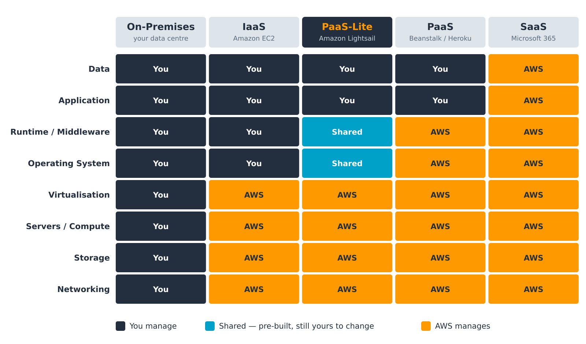
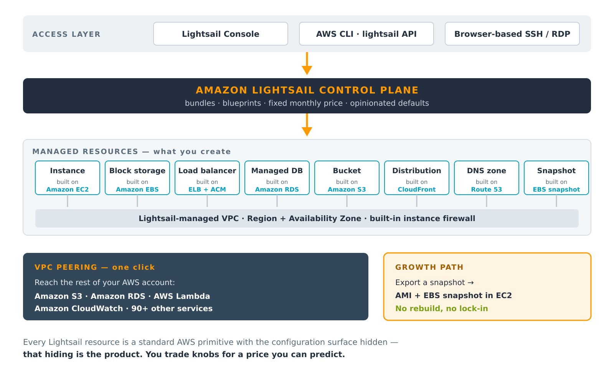
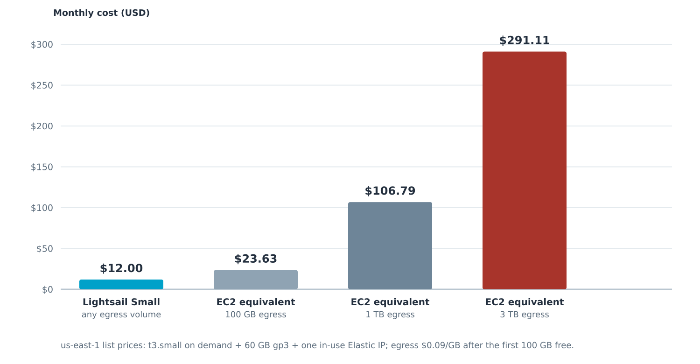
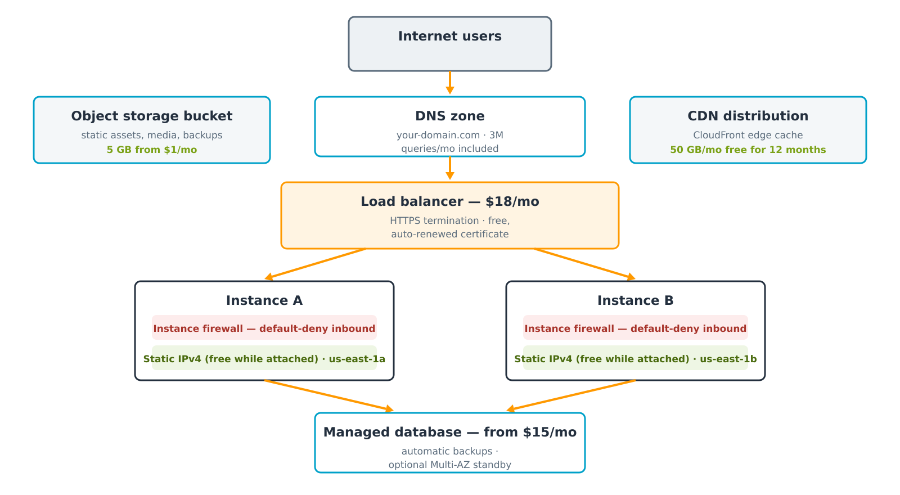
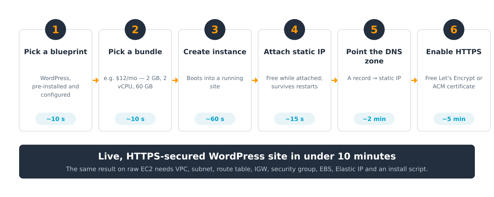
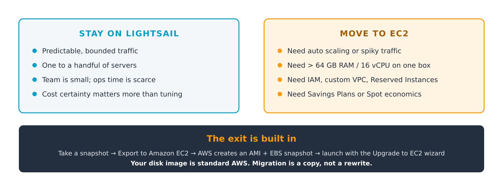

# Amazon Lightsail (PaaS-Lite) — Cloud Infrastructure

### A Technical Report

**Submitted by:** Hridiyansh Shukla  
**Registration Number:** 2427030591  
**Topic:** Amazon Lightsail (PaaS-Lite) — Cloud Infrastructure  
**Date:** August 2026

---

## Abstract

Amazon Lightsail is Amazon Web Services' fixed-price virtual private server (VPS) product, introduced
in November 2016 to serve users for whom Amazon EC2 offers more configurability than they need. This
report examines Lightsail as an example of a distinctive position on the cloud abstraction ladder — one
that is neither pure Infrastructure-as-a-Service nor pure Platform-as-a-Service, and which this report
characterises as *PaaS-Lite*: the operating system and application runtime are pre-built for the user in
the manner of a PaaS, yet full root access is retained in the manner of an IaaS.

The report sets out the service's architecture, showing that each Lightsail resource is an existing AWS
primitive with its configuration surface deliberately reduced. It documents the complete resource
catalogue, the blueprint and bundle model, and the published price list as of August 2026. A worked cost
comparison against an equivalent EC2 deployment demonstrates that Lightsail's economic advantage lies
almost entirely in its included data-transfer allowance rather than in cheaper compute — at three
terabytes of monthly egress the modelled EC2 build costs **$291.11** against Lightsail's flat **$12.00**,
while at one hundred gigabytes the same comparison narrows to **$23.63** against **$12.00**.

The report then evaluates the service critically. Lightsail offers no instance auto scaling, no Reserved
Instances or Savings Plans, and only coarse access control, and it is capped by default at twenty
instances per account. These are argued to be deliberate consequences of the fixed-price model rather
than defects, and each is identified as a signal that a workload has outgrown the service. The report
concludes that Lightsail is best understood not as a cheaper AWS but as a deliberately narrower one,
designed so that outgrowing it — through the built-in snapshot export to EC2 — is the expected outcome
rather than a failure.

---

## Table of Contents

1. [Introduction](#1-introduction)
2. [Cloud Service Models and Lightsail's Position](#2-cloud-service-models-and-lightsails-position)
3. [Amazon Lightsail: Service Overview](#3-amazon-lightsail-service-overview)
4. [System Architecture](#4-system-architecture)
5. [Core Components and Resource Catalogue](#5-core-components-and-resource-catalogue)
6. [The Pricing Model](#6-the-pricing-model)
7. [Networking and Security](#7-networking-and-security)
8. [Comparative Analysis](#8-comparative-analysis)
9. [Practical Deployment](#9-practical-deployment)
10. [Application Areas](#10-application-areas)
11. [Limitations and Critical Evaluation](#11-limitations-and-critical-evaluation)
12. [The Migration Path](#12-the-migration-path)
13. [Conclusion](#13-conclusion)
14. [References](#14-references)

---

## 1. Introduction

### 1.1 Background

Cloud computing is conventionally described as a ladder of abstraction. At the bottom, Infrastructure-as-a-Service
(IaaS) rents raw virtualised hardware and leaves everything above the hypervisor to the customer. At the
top, Software-as-a-Service (SaaS) delivers a finished application and hides everything beneath it.
Platform-as-a-Service (PaaS) occupies the middle, providing a managed runtime into which the customer
deploys code without ever administering a server.

Amazon Elastic Compute Cloud (EC2), launched in 2006, is the archetypal IaaS offering and remains the
foundation of the AWS compute portfolio. Its defining characteristic is configurability: more than 750
instance types, fully user-designed virtual networking, and per-second billing across independently
metered dimensions. That configurability is the reason EC2 can host essentially any workload.

### 1.2 Problem Statement

The same configurability is a barrier for a large class of users. Before a bare EC2 instance can serve a
single HTTP request, the operator must create or select a Virtual Private Cloud, a subnet, a route table,
an internet gateway, a security group, an Elastic Block Store volume, an SSH key pair and an Elastic IP
address — eight distinct resources, most of which have no bearing on the application itself.

Three specific difficulties follow:

1. **Decision burden.** The number of choices required before deployment is disproportionate to the
   simplicity of the workload. A personal blog requires the same networking design as a distributed system.
2. **Cost unpredictability.** EC2 bills compute, storage, outbound data transfer and the public IPv4
   address on four separate meters. A small operator cannot forecast the next invoice with confidence,
   and outbound data transfer in particular scales in a way that surprises inexperienced users.
3. **Skills mismatch.** Students, freelancers, designers and small businesses typically require a running
   server rather than expertise in cloud architecture.

Amazon Lightsail was introduced to address precisely this gap.

### 1.3 Objectives and Scope

This report aims to:

- position Lightsail accurately within the cloud service model taxonomy, and justify the *PaaS-Lite* label;
- describe its architecture and demonstrate its relationship to underlying AWS services;
- document the complete resource catalogue and the published pricing model as of August 2026;
- quantify the cost difference against an equivalent EC2 deployment using a reproducible model;
- compare the service with EC2 and with competing platforms; and
- evaluate its limitations critically and identify the conditions under which it should be abandoned.

The scope is limited to the general-purpose Lightsail service. Lightsail for Research, a related offering
that packages CPU and GPU research workstations under the same commercial model, is noted where relevant
but not examined in depth.

---

## 2. Cloud Service Models and Lightsail's Position

### 2.1 The Division of Responsibility

The clearest way to distinguish cloud service models is by which layers of the stack the provider operates
and which the customer retains. Figure 1 sets out that division across five models.



**Figure 1** — Division of management responsibility across cloud service models.
{: .caption }

### 2.2 Reading the Figure

- **On-premises.** The customer manages all eight layers, from physical networking to application data.
- **IaaS (Amazon EC2).** AWS assumes responsibility for networking, storage, physical servers and
  virtualisation. The customer receives a bare virtual machine and manages the operating system upward.
- **PaaS (AWS Elastic Beanstalk, Heroku).** AWS additionally assumes the operating system and the
  application runtime. The customer supplies application code and data, and never administers a server.
- **SaaS (Microsoft 365).** The provider manages every layer; the customer supplies only their data.

### 2.3 Why "PaaS-Lite"

Lightsail does not fit cleanly into either the IaaS or the PaaS column, which is why the intermediate
label is warranted. Its behaviour at the operating system and runtime layers is genuinely hybrid:

- **Like a PaaS,** AWS pre-builds those layers. Selecting the WordPress blueprint yields an instance on
  which Linux, Apache, PHP, MySQL and WordPress are already installed, configured and running. The user
  performs no installation and makes no runtime decisions.
- **Like an IaaS,** the user retains root. SSH access is provided from the first minute, the operating
  system may be reconfigured or replaced entirely, and any software may be installed.

The consequence is a service offering PaaS convenience on the first day and IaaS control on the second.
This hybrid position, rather than any pricing innovation, is the defining characteristic of the product.
It also explains the service's principal liability: because the customer retains root, the customer also
retains the obligation to patch — a responsibility a true PaaS would absorb. Section 7.2 returns to this.

---

## 3. Amazon Lightsail: Service Overview

### 3.1 Definition

Amazon Lightsail is AWS's virtual private server offering: pre-configured compute, storage, networking and
managed services, sold as fixed-price monthly bundles through a deliberately simplified console.

### 3.2 History and Availability

| Date | Development |
|---|---|
| 30 November 2016 | Announced at AWS re:Invent; launched in US East (N. Virginia) |
| 2017 | Expanded to nine further AWS Regions; global console introduced |
| November 2017 | Additional block storage introduced |
| August 2018 | Price reduction of up to 50%; two larger instance sizes added |
| November 2018 | Snapshot export to Amazon EC2 introduced, creating a formal upgrade path |
| October 2018 | Managed databases (MySQL, later PostgreSQL) introduced |
| June 2021 | Object storage buckets introduced |
| 2021 | Lightsail containers introduced |
| November 2022 | Lightsail for Research announced |
| January 2026 | AWS-maintained Node.js, LAMP and Ruby on Rails blueprints released |
| February 2026 | Memory-optimised instance bundles introduced, to 512 GB of memory |
| April 2026 | Compute-optimised instance bundles introduced, to 72 vCPU |
| June 2026 | Availability extended to Asia Pacific (Hong Kong), South America (São Paulo) and Europe (Spain) |

Lightsail is available in a subset of AWS Regions rather than all of them — a practical constraint where
data residency requirements apply.

### 3.3 Design Philosophy

Three principles govern the service and explain most of its design decisions:

1. **A fixed price stated before deployment.** Every resource carries a flat monthly figure with an
   allowance attached, rather than a meter.
2. **Fewer choices, made well.** Eight general-purpose bundles replace 750 instance types. The defaults
   are opinionated and generally correct for small workloads.
3. **No architectural dead end.** Every resource is a standard AWS primitive, and a documented export path
   to EC2 exists. The service is explicitly designed to be outgrown.

---

## 4. System Architecture

### 4.1 The Control Plane

Lightsail is not a separate infrastructure platform. It is a curated control plane over services AWS
already operates, as Figure 2 shows.



**Figure 2** — The Lightsail control plane and the AWS primitives beneath it.
{: .caption }

The user reaches the service through the Lightsail console, the AWS CLI (`aws lightsail …`), the Lightsail
API, or browser-based SSH and RDP clients that require no local key management. The control plane holds
the bundles, the blueprints and the opinionated defaults, and translates a small number of user choices
into a correctly configured set of underlying AWS resources.

### 4.2 Mapping to AWS Primitives

| Lightsail resource | Underlying AWS service | Configuration hidden from the user |
|---|---|---|
| Instance | Amazon EC2 | Instance type selection, placement, tenancy, most launch parameters |
| Block storage disk | Amazon EBS | Volume type, IOPS and throughput provisioning |
| Load balancer | Elastic Load Balancing + AWS Certificate Manager | Listener rules, target group configuration, certificate lifecycle |
| Managed database | Amazon RDS | Parameter groups, option groups, subnet groups, maintenance windows |
| Object storage bucket | Amazon S3 | Storage classes, lifecycle rules, most bucket policy detail |
| CDN distribution | Amazon CloudFront | Cache behaviours, origin request policies, edge function hooks |
| DNS zone | Amazon Route 53 | Routing policies, health checks, traffic flow |
| Static IP | Elastic IP | Allocation and association mechanics |
| Snapshot | EBS snapshot | Snapshot lifecycle and copy semantics |

This mapping is the single most important technical fact about Lightsail. The hardware and the services
are unchanged from the rest of AWS; the product is the removal of configuration surface. That is also why
migration to EC2 is a copy rather than a rewrite (Section 12).

### 4.3 The Networking Model

Lightsail resources are placed in an AWS-managed VPC that the customer does not design and cannot
directly modify. This is the source of both the service's simplicity and its principal architectural
limitation. To bridge the gap, Lightsail supports one-click **VPC peering** between the Lightsail-managed
VPC and the default VPC of the same AWS account and Region, after which resources in the wider account —
Amazon S3, Amazon RDS, AWS Lambda, Amazon CloudWatch and others — become reachable.

---

## 5. Core Components and Resource Catalogue

Ten resource types constitute the whole service.

| Resource | What it provides | Built on |
|---|---|---|
| Instance | Virtual server with a fixed bundle of vCPU, RAM, SSD and data transfer | Amazon EC2 |
| Container service | Runs Docker images behind a managed HTTPS endpoint, with no cluster to operate | ECS / Fargate |
| Managed database | MySQL or PostgreSQL with automated backups and an optional standby | Amazon RDS |
| Block storage disk | Additional SSD volumes attached to a running instance | Amazon EBS |
| Object storage bucket | Static assets, media and backups served over HTTPS | Amazon S3 |
| Load balancer | Distributes traffic across instances; includes a free, auto-renewed certificate | ELB + ACM |
| CDN distribution | Edge caching in front of an instance, bucket or load balancer | Amazon CloudFront |
| DNS zone | Authoritative DNS with three million queries per month included | Amazon Route 53 |
| Static IP | A fixed public IPv4 address that survives stop, start and restore | Elastic IP |
| Snapshot | Point-in-time backup of an instance or disk; exportable to EC2 | EBS snapshot |

### 5.1 Instances: Blueprints and Bundles

Creating a Lightsail instance requires exactly two decisions.

**The blueprint** determines the software the machine boots into.

*Operating system blueprints:* Amazon Linux 2, Amazon Linux 2023, Ubuntu, Debian, AlmaLinux OS 9, CentOS,
FreeBSD, openSUSE, and Windows Server 2016, 2019 and 2022.

*Application blueprints:* WordPress, WordPress Multisite, LAMP, Nginx (LEMP), Node.js, Ruby on Rails,
Django, Drupal, Joomla!, Magento, PrestaShop, Ghost, Redmine, GitLab, MEAN, cPanel & WHM, and Plesk.

> **Important — blueprint transition in progress.** Many application blueprints were historically packaged
> by Bitnami. AWS stopped providing newer Bitnami-packaged versions on **19 May 2026**. The WordPress,
> WordPress Multisite, LAMP, Nginx and Node.js Bitnami blueprints are deprecated on **19 November 2026**,
> and Joomla, Magento, MEAN, Drupal, GitLab, Redmine, Ghost, Django and PrestaShop follow on
> **19 May 2027**. AWS-maintained replacements for Node.js, LAMP and Ruby on Rails were released in
> January 2026. New projects should select an AWS-maintained blueprint or a plain OS image.

**The bundle** determines the hardware and the price, which are fixed together. Three families exist:

- **General purpose** — eight sizes from 512 MB to 64 GB of memory (Section 6.1).
- **Memory optimised** — introduced February 2026, seven sizes to 512 GB of memory, for in-memory caching,
  real-time analytics and large database workloads.
- **Compute optimised** — introduced April 2026, seven sizes to 72 vCPU, for batch processing, media
  encoding, high-performance web servers and CPU-bound inference.

Entry-level bundles use **burstable** vCPU: the instance receives a baseline share of CPU and accrues
credits when idle, which it spends when bursting above baseline. Sustained full load exhausts the credits
and the instance is throttled to baseline. Bundles at $24 per month and above provide dedicated vCPU and
do not exhibit this behaviour. This distinction is frequently overlooked and is a common cause of
unexplained performance complaints on the cheapest plans.

### 5.2 Containers

The Lightsail container service runs Docker images behind a managed HTTPS endpoint with a provided
domain name and certificate, requiring no cluster, load balancer or orchestrator configuration. A service
is defined by a **power** (the node size: Nano, Micro, Small, Medium, Large or XLarge) and a **scale**
(the number of nodes). The monthly price is the power price multiplied by the node count. Each container
service includes a 500 GB monthly data-transfer quota. Unlike instances, container services can be scaled
by changing the node count, which is the closest the service comes to elasticity.

### 5.3 Managed Databases

Lightsail managed databases run MySQL or PostgreSQL with automated backups, automatic patching and a
choice of **standard** or **high-availability** plans. High-availability plans maintain a synchronous
standby in a second Availability Zone and cost exactly double the standard plan. Larger database bundles
were added in January 2026, reaching 8 vCPU, 32 GB of memory and 960 GB of storage.

### 5.4 Storage

**Block storage** provides additional SSD volumes attached to a running instance, billed per gigabyte
per month, with up to 16 TB attachable per instance. **Object storage buckets** serve static assets,
media and backups over HTTPS, sold in three fixed bundles rather than metered per request.

### 5.5 Delivery: Load Balancers, CDN, DNS and Static IPs

The **load balancer** distributes traffic across instances in multiple Availability Zones, performs
health checks, terminates TLS, and — notably — issues and automatically renews certificates at no
additional charge. **CDN distributions** place CloudFront in front of an instance, bucket or load
balancer. **DNS zones** provide authoritative DNS with three million queries per month included, up to
six zones by default. **Static IPs** are fixed public IPv4 addresses that survive instance stop, start
and restore; they are free while attached and billed only if left unattached.

---

## 6. The Pricing Model

### 6.1 Instance Bundles

Linux/Unix general-purpose bundles with a public IPv4 address, as published in August 2026:

| Bundle | Memory | vCPU | SSD storage | Transfer / month | Linux $/month | Windows $/month |
|---|---:|---:|---:|---:|---:|---:|
| Nano | 512 MB | 2 | 20 GB | 1 TB | $5 | $9.50 |
| Micro | 1 GB | 2 | 40 GB | 2 TB | $7 | $14 |
| Small | 2 GB | 2 | 60 GB | 3 TB | $12 | $22 |
| Medium | 4 GB | 2 | 80 GB | 4 TB | $24 | — |
| Large | 8 GB | 2 | 160 GB | 5 TB | $44 | — |
| XLarge | 16 GB | 4 | 320 GB | 6 TB | $84 | — |
| 2XLarge | 32 GB | 8 | 640 GB | 7 TB | $164 | — |
| 4XLarge | 64 GB | 16 | 1,280 GB | 8 TB | $384 | — |

Three qualifications apply:

- **IPv6-only bundles cost roughly 30% less.** A public IPv4 address has become the premium component:
  the Linux nano tier falls from $5.00 to $3.50 when provisioned without one. This reflects the wider
  industry repricing of scarce IPv4 space.
- **Transfer beyond the allowance is metered per gigabyte.** Inbound traffic, and traffic to other AWS
  services within the same Region, do not count against the allowance.
- **Selected entry bundles carry a three-month introductory credit** for new accounts, on Linux/Unix
  IPv6 bundles at the $3.50, $5 and $10 tiers.

### 6.2 Other Resources

| Resource | Representative configuration | Price | Included |
|---|---|---|---|
| Container service | Nano node — 0.25 vCPU, 512 MB | $7 / month per node | 500 GB transfer per service |
| Container service | XLarge node — 4 vCPU, 8 GB | $160 / month per node | Total = price × node count |
| Managed database | 1 GB RAM, 40 GB SSD (standard) | $15 / month | HA plans cost double |
| Object storage | 5 GB storage, 25 GB transfer | $1 / month | Free for the first 12 months |
| Object storage | 100 GB storage, 250 GB transfer | $3 / month | — |
| Object storage | 250 GB storage, 500 GB transfer | $5 / month | — |
| Load balancer | Includes managed TLS certificate | $18 / month | Certificate issue and renewal free |
| CDN distribution | CloudFront edge caching | $2.50 / month | 50 GB/month free for 12 months |
| Block storage | Additional SSD disk | $0.10 / GB / month | Up to 16 TB per instance |
| Snapshots | Instance or disk backup | $0.05 / GB / month | Manual and automatic both charged |
| Static IP | Public IPv4 address | Free while attached | $0.005/hour if left unattached |
| DNS zone | Authoritative DNS | Free (up to 6 zones) | 3 million queries per month |

The pattern is consistent across the catalogue: AWS sells an **allowance**, not a **meter**. This is the
entire commercial difference between Lightsail and the rest of AWS, and it determines where the service
is and is not economical.

### 6.3 Cost Analysis Against Amazon EC2

To quantify the difference, the Lightsail Small bundle ($12/month; 2 GB RAM, 2 vCPU, 60 GB SSD, 3 TB
transfer) is compared against an equivalent architecture assembled from EC2 components at us-east-1
list prices.

**Model components**

| Component | Specification | Unit price | Monthly cost |
|---|---|---|---:|
| Compute | t3.small on demand, 730 hours | $0.0208 / hour | $15.18 |
| Storage | 60 GB gp3 EBS volume | $0.08 / GB-month | $4.80 |
| Public IPv4 | One in-use Elastic IP, 730 hours | $0.005 / hour | $3.65 |
| Data transfer out | First 100 GB free, then metered | $0.09 / GB | *varies* |
| | | **Fixed subtotal** | **$23.63** |

**Total monthly cost at three egress volumes**

| Monthly egress | Billable GB | Transfer cost | EC2 total | Lightsail total | Difference |
|---|---:|---:|---:|---:|---:|
| 100 GB | 0 | $0.00 | **$23.63** | $12.00 | +$11.63 |
| 1 TB (1,024 GB) | 924 | $83.16 | **$106.79** | $12.00 | +$94.79 |
| 3 TB (3,072 GB) | 2,972 | $267.48 | **$291.11** | $12.00 | +$279.11 |



**Figure 3** — Modelled monthly cost of an equivalent deployment on EC2 against the flat Lightsail bundle price.
{: .caption }

**Interpretation.** The comparison must be read carefully, and three qualifications matter:

1. **Data transfer, not compute, drives the gap.** The compute and storage components are broadly
   comparable — $19.98 of EC2 resources against a $12.00 bundle. Every dollar of the remaining
   difference is egress and the IPv4 address.
2. **The advantage is conditional on actually using the allowance.** A site serving 100 GB per month
   saves $11.63; one serving 3 TB saves $279.11. Lightsail's fixed price is a wager that most small
   workloads never approach their allowance — which is precisely why AWS can offer it.
3. **EC2 recovers ground through instruments Lightsail lacks.** Savings Plans, Reserved Instances and
   Spot pricing can reduce the compute component substantially. They cannot, however, reduce egress,
   which is where the difference actually lies.

The honest conclusion is that Lightsail's economic case rests on **bandwidth included in the price** and
on **cost certainty stated in advance**, not on cheaper computing.

### 6.4 Free Tier

New accounts receive a three-month introductory credit on selected Linux/Unix IPv6 instance bundles, and
twelve months free on the first object storage bundle (5 GB) and on CDN distributions up to 50 GB per
month. These are onboarding incentives rather than a perpetual free tier.

---

## 7. Networking and Security



**Figure 4** — A conventional highly available Lightsail deployment.
{: .caption }

### 7.1 Security Defaults

Lightsail's security posture is deliberately sensible by default:

- **Per-instance firewall.** Every instance carries its own firewall, configured from the console, opening
  only the ports the selected blueprint requires. The default is deny.
- **Free managed TLS.** A load balancer issues and automatically renews certificates at no charge.
  Instances not behind a load balancer can use Let's Encrypt, which the Bitnami and AWS blueprints
  include tooling to configure.
- **Stable addressing.** A static IPv4 address survives instance stop, start and restore, and is free
  while attached. The $0.005/hour charge on unattached addresses exists to discourage hoarding of scarce
  IPv4 space.
- **Isolation with a bridge.** Resources sit in a Lightsail-managed VPC, peered to the account's default
  VPC on request.
- **Automatic snapshots.** Scheduled snapshots can be enabled per instance, giving point-in-time recovery
  without external tooling.

### 7.2 The Responsibility That Does Not Transfer

The most commonly misunderstood aspect of the service is that a simplified console does not reduce the
customer's security obligations. Under the AWS shared responsibility model, AWS secures the cloud
infrastructure; the customer secures what runs on it. Because Lightsail grants root access, the customer
remains responsible for:

- patching the operating system;
- patching the application inside the blueprint — a WordPress instance requires the same update discipline
  as any other WordPress installation;
- managing SSH keys and access; and
- configuring the firewall correctly when the defaults are changed.

A blueprint is current on the day it is provisioned and ages from that moment. The ease of creating a
Lightsail instance makes it correspondingly easy to accumulate unpatched servers, which is a genuine
operational risk for exactly the inexperienced users the service targets.

---

## 8. Comparative Analysis

### 8.1 Lightsail Against Amazon EC2

| Dimension | Amazon Lightsail | Amazon EC2 |
|---|---|---|
| Pricing model | Fixed monthly bundle, allowance included | Per-second metering across four separate meters |
| Choice of hardware | Eight general-purpose bundles plus two specialised families | More than 750 instance types |
| Maximum single instance | 64 GB / 16 vCPU general purpose; 512 GB memory optimised | Up to 448 vCPU and 12,288 GB of memory |
| Networking | Lightsail-managed VPC; peering to the default VPC | Full VPC design: subnets, route tables, NAT, gateways |
| Automatic scaling | Not available for instances; containers scale by node count | EC2 Auto Scaling groups with policies and schedules |
| Discount instruments | None — the list price is the price | Reserved Instances, Savings Plans, Spot |
| Access control | Coarse; Lightsail-level permissions | Full IAM, resource policies, service control policies |
| Monitoring | Built-in metrics and alarms, simplified | Full CloudWatch, custom metrics, detailed monitoring |
| Time to first server | Minutes, from a menu | Longer; several dependent resources must exist first |
| Best fit | Predictable small workloads, fast delivery, cost certainty | Elastic, large or compliance-heavy architectures |

The two services are complements rather than competitors. Lightsail is the on-ramp; EC2 is the motorway.
The snapshot export exists specifically so that the journey between them is inexpensive.

### 8.2 Lightsail Against the Wider Market

Indicative entry pricing, August 2026. Figures are list prices and vary by region.

| Platform | Entry price | Customer still manages | Distinguishing strength | Principal watch-out |
|---|---|---|---|---|
| Amazon Lightsail | $5 / month (nano, dual-stack) | OS and application | Generous transfer allowance; documented path onto full AWS | Not available in every Region; coarse IAM |
| DigitalOcean Droplet | $4 / month (512 MB); $6 practical floor | OS and application | Clean developer experience and documentation | Smaller managed-service portfolio |
| Linode / Akamai Nanode | $5 / month (1 GB, 25 GB SSD, 1 TB) | OS and application | Strong price-to-memory ratio at the entry tier | Ecosystem narrower than AWS |
| Heroku dyno | $5 Eco (sleeps) · $7 Basic | Application only | True PaaS — no server to patch | Add-ons billed separately; cost rises steeply |
| Azure App Service | Basic B1 approximately $55 / month | Application only | Deep integration with the Microsoft estate | Substantially higher entry price |

**Assessment.** On raw price per gigabyte of memory, Lightsail is competitive rather than cheapest —
DigitalOcean starts lower, and Linode offers more memory at the same $5 tier. Lightsail's advantage lies
in two properties a price list does not display:

1. **The included data-transfer allowance**, which is where independent VPS bills most often break; and
2. **The nature of the resource underneath.** Because a Lightsail instance is an EC2 instance, outgrowing
   the service is a migration within a single AWS account rather than a change of vendor. For an
   organisation that expects to grow, this is a material strategic difference.

---

## 9. Practical Deployment

### 9.1 Console Workflow



**Figure 5** — The complete deployment path for a production WordPress site.
{: .caption }

| Step | Action | Approximate time |
|---:|---|---|
| 1 | Select the WordPress blueprint | ~10 s |
| 2 | Select a bundle (for example, $12/month — 2 GB, 2 vCPU, 60 GB) | ~10 s |
| 3 | Create the instance; it boots into a running site | ~60 s |
| 4 | Create and attach a static IP | ~15 s |
| 5 | Create a DNS zone and point an A record at the static IP | ~2 min |
| 6 | Enable HTTPS with a Let's Encrypt or ACM certificate | ~5 min |

The result is a live, HTTPS-secured, production-capable WordPress site in under ten minutes. The same
outcome on raw EC2 requires all eight prerequisite resources identified in Section 1.2 to be created and
correctly wired together before installation begins.

### 9.2 Command-Line Equivalent

Nothing in the workflow is console-only; the same operations are available through the AWS CLI, which
makes Lightsail deployments scriptable and reproducible:

```bash
# 1–3. Create a WordPress instance on the Small bundle
aws lightsail create-instances \
    --instance-names my-site \
    --availability-zone us-east-1a \
    --blueprint-id wordpress \
    --bundle-id small_3_0

# 4. Allocate and attach a static IP
aws lightsail allocate-static-ip --static-ip-name my-site-ip
aws lightsail attach-static-ip --static-ip-name my-site-ip --instance-name my-site

# 5. Create a DNS zone and an A record
aws lightsail create-domain --domain-name example.com
aws lightsail create-domain-entry --domain-name example.com \
    --domain-entry name=example.com,type=A,target=<static-ip>

# Open the firewall for HTTPS
aws lightsail open-instance-public-ports \
    --instance-name my-site \
    --port-info fromPort=443,toPort=443,protocol=TCP

# Retrieve the one-time WordPress administrator password
aws lightsail get-instance-access-details --instance-name my-site
```

---

## 10. Application Areas

| Use case | Why Lightsail suits it |
|---|---|
| **Websites and blogs** | WordPress, Ghost and Drupal blueprints deploy instantly, and the bundle's transfer allowance comfortably covers ordinary traffic. |
| **Development and test environments** | Disposable environments mirroring production, created for a sprint and deleted afterwards; the fixed price makes the cost of the experiment knowable. |
| **Small business applications** | Line-of-business tools, booking systems and intranets for organisations with no dedicated operations staff. |
| **E-commerce storefronts** | Magento and PrestaShop blueprints combined with a managed database and a CDN distribution. |
| **Learning and coursework** | A genuine cloud server for a few dollars a month — the most accessible entry point into AWS for a student. |
| **Research computing** | Lightsail for Research packages CPU and GPU workstations under the same fixed-price model, aimed at researchers without cloud administration experience. |
| **Simple container workloads** | Applications already containerised but not warranting ECS or Kubernetes. |

The common thread is a workload whose **ceiling is known in advance**. Where demand is genuinely
unpredictable, the absence of auto scaling makes Lightsail a poor fit.

---

## 11. Limitations and Critical Evaluation

### 11.1 Architectural Limitations

- **No instance auto scaling.** Capacity is a manual decision. Traffic spikes must be absorbed by
  over-provisioning or handled by adding instances behind a load balancer by hand. Container services
  scale by node count, but only if reconfigured.
- **No discount instruments.** Reserved Instances, Savings Plans and Spot pricing are unavailable. At
  sustained scale, a comparable EC2 deployment under a Savings Plan becomes cheaper.
- **Coarse access control.** Lightsail-level permissions are not a substitute for IAM. Where
  least-privilege access is formally audited — regulated industries, or any organisation with a
  compliance function — this alone disqualifies the service.
- **Limited AWS integration.** Access to the wider AWS estate is mediated by VPC peering rather than
  native integration.
- **Burstable CPU on entry tiers.** Bundles below $24 per month throttle to baseline once CPU credits
  are exhausted, which is a frequent cause of unexplained slowness.
- **Ceiling on single-instance size.** General-purpose bundles stop at 64 GB and 16 vCPU. The specialised
  families extend this, but not to EC2's range.

### 11.2 Operational and Commercial Limitations

- **Default quotas** of 20 instances, 5 static IPs and 6 DNS zones per account. These can be raised on
  request, but they constrain the service's use as a fleet platform.
- **Transfer overage is billed per gigabyte**, so the fixed price is a floor rather than a cap.
- **Patching remains the customer's responsibility**, as set out in Section 7.2.
- **Blueprint churn.** The Bitnami deprecation through 2026–2027 obliges existing users to migrate.
- **Incomplete regional coverage** compared with EC2.

### 11.3 Assessment

None of these constitutes a defect in the engineering sense. Each is a direct and predictable consequence
of the fixed-price, low-choice model: a service cannot simultaneously guarantee a price in advance and
offer unlimited elasticity, and it cannot present three configuration options while exposing the full IAM
surface. The limitations are the cost of the proposition.

Their practical value is diagnostic. Each limitation functions as a **signal** that a workload has
outgrown the service. When auto scaling becomes necessary, when Savings Plans would materially reduce
the bill, or when an auditor asks for least-privilege access, the correct response is not to work around
Lightsail but to migrate.

---

## 12. The Migration Path



**Figure 6** — The decision boundary, and the built-in migration route across it.
{: .caption }

**Remain on Lightsail while:** traffic is predictable and bounded; the estate comprises one to a handful
of servers; the team is small and operations time is scarce; and cost certainty matters more than
optimisation.

**Migrate to EC2 when:** auto scaling or spiky traffic handling is required; a single instance must exceed
64 GB of memory or 16 vCPU; fine-grained IAM or custom VPC design is required; or Savings Plans and Spot
economics would materially reduce the bill.

**The migration procedure:**

1. Take a snapshot of the Lightsail instance.
2. Export the snapshot to Amazon EC2. AWS creates an Amazon Machine Image (AMI) and an EBS snapshot in
   the same account and Region.
3. Launch the AMI using the *Upgrade to EC2* wizard in the Lightsail console, or through the normal EC2
   launch process for full control over networking and instance type.
4. Reconfigure networking — security groups, Elastic IP, load balancer — since Lightsail's managed
   equivalents do not transfer.
5. Cut DNS over and decommission the Lightsail resources.

The essential point is that the disk image is standard AWS. Migration is a **copy**, not a rewrite. This
is the strategic argument for choosing Lightsail over an independent VPS provider: the exit is a
supported first-party workflow rather than a server rebuild on someone else's platform.

---

## 13. Conclusion

Amazon Lightsail occupies a genuinely distinct position in the cloud service taxonomy. It is not
Infrastructure-as-a-Service, because the operating system and application runtime arrive pre-built; and it
is not Platform-as-a-Service, because the customer keeps root and therefore keeps the patching obligation.
*PaaS-Lite* describes that hybrid accurately: PaaS convenience on the first day, IaaS control on the
second.

Four conclusions follow from this study.

**First, Lightsail sells predictability rather than power.** The bundle is a price known before deployment,
and every other design decision — the small menu, the opinionated defaults, the absence of discount
instruments — follows from that single commercial commitment.

**Second, the economic advantage is narrower than commonly claimed and lies in bandwidth.** The cost model
in Section 6.3 shows compute and storage to be broadly comparable with EC2 list prices; the difference is
almost entirely the included data-transfer allowance and the public IPv4 address. Against an EC2
deployment under a Savings Plan and with modest egress, Lightsail's advantage is real but small.

**Third, the service's simplicity does not extend to security.** Root access means retained
responsibility, and the ease of provisioning makes unpatched instances easy to accumulate. This is the
service's most under-discussed liability.

**Fourth, its limitations are best read as exit signs.** The absence of auto scaling, Savings Plans and
fine-grained IAM are not oversights but the price of the proposition, and each marks the boundary at
which a workload should move.

The final assessment is that Lightsail should not be understood as a cheaper AWS but as a deliberately
**narrower** one — a service engineered with a documented export path precisely because outgrowing it is
the expected outcome rather than a failure. Judged against that intent, it succeeds: it removes the
decision burden, the cost uncertainty and the skills barrier that keep small operators off the cloud,
and it does so without creating an architectural dead end.

---

## 14. References

1. Amazon Web Services. *Amazon Lightsail — Pricing.* https://aws.amazon.com/lightsail/pricing/
2. Amazon Web Services. *Amazon Lightsail User Guide* — instance bundles, blueprints, buckets, container
   services, baseline CPU performance and account quotas. https://docs.aws.amazon.com/lightsail/
3. Amazon Web Services. *Amazon Lightsail FAQs.* https://aws.amazon.com/lightsail/faq/
4. Amazon Web Services. "Announcing memory-optimized instance bundles for Amazon Lightsail." *AWS What's
   New*, 2 February 2026.
5. Amazon Web Services. "Announcing compute-optimized instance bundles for Amazon Lightsail." *AWS What's
   New*, April 2026.
6. Amazon Web Services. "Amazon Lightsail expands blueprint selection with updated support for Node.js,
   LAMP, and Ruby on Rails blueprints." *AWS What's New*, January 2026.
7. Amazon Web Services. "Announcing larger managed database bundles for Amazon Lightsail." *AWS What's
   New*, January 2026.
8. Amazon Web Services. "Amazon Lightsail is now available in three additional AWS Regions." *AWS What's
   New*, June 2026.
9. Amazon Web Services. *Blueprints packaged by Bitnami* — deprecation schedule 2026–2027. Amazon
   Lightsail documentation.
10. Amazon Web Services. *Export Lightsail snapshots to Amazon EC2* and *Create Amazon EC2 instances from
    exported Lightsail snapshots.* Amazon Lightsail documentation.
11. Amazon Web Services. "Amazon Lightsail Now Provides an Upgrade Path to EC2." *AWS What's New*,
    November 2018.
12. AWS re:Post. "Compare Amazon EC2 and Amazon Lightsail." *AWS Knowledge Center.*
13. Amazon Web Services. *Amazon EC2 On-Demand Pricing* and *Amazon EBS Pricing*, us-east-1 — used to
    construct the cost model in Section 6.3.
14. Barr, J. "Amazon Lightsail — the Power of AWS, the Simplicity of a VPS." *AWS News Blog*,
    30 November 2016.
15. Amazon Web Services. "New — Amazon Lightsail for Research with All-in-One Research Environments."
    *AWS News Blog.*
16. DigitalOcean, Akamai (Linode), Heroku and Microsoft Azure published price lists, consulted
    August 2026 for the comparison in Section 8.2.

---

*Prepared by Hridiyansh Shukla · Registration No. 2427030591 · August 2026*
