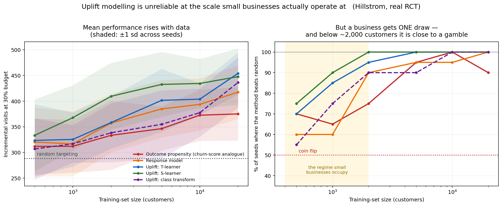
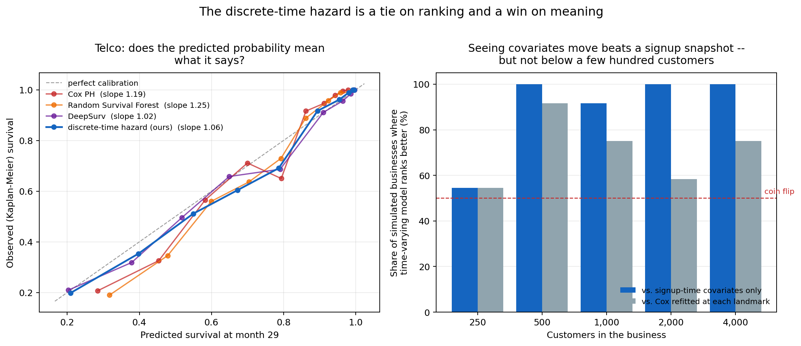
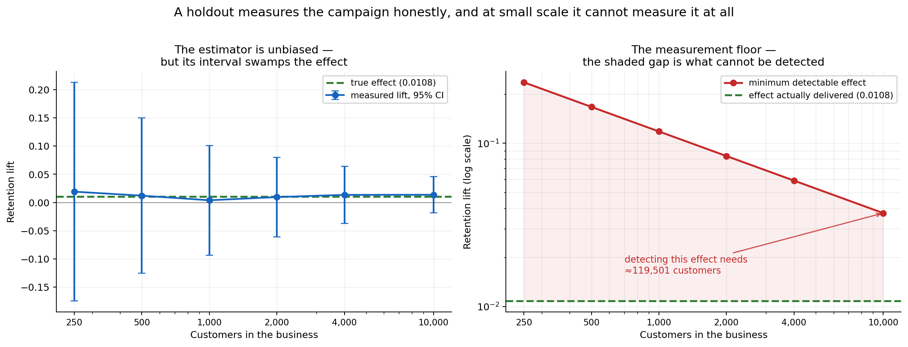

# When Does Uplift Modelling Pay? A Correlation Criterion and a Measurement Floor for Small-Scale Subscription Retention

*Running head: When Does Uplift Modelling Pay?*

**Prasham Jain**¹, **Rishi Gupta**¹\*

¹Department of Computer Science and Engineering, Manipal University Jaipur, Rajasthan 303007, India

Registration Number: 2427030155 · B.Tech Computer Science and Engineering, V Semester, 3rd Year

Corresponding author: Rishi Gupta (rishi.gupta@jaipur.manipal.edu)
Student author: prasham.2427030155@muj.manipal.edu

Code, data pipelines and every number in this paper: `https://github.com/PrashamJ17/PBL-Proj`

---

## ABSTRACT

Uplift modelling — targeting customers by estimated treatment effect rather than by outcome propensity — is widely recommended and inconsistently useful. We show that whether it pays is governed by a single measurable quantity: **corr(τ̂, π̂)**, the correlation across customers between the estimated treatment effect and the estimated outcome propensity. Across four real randomised controlled trials (Hillstrom, split by arm; Criteo-UPLIFT v2.1; Lenta) and one calibrated simulator, the advantage of effect-based targeting rises monotonically as this correlation falls: it is **−5.6%** at corr = +0.69, **+0.6%** at +0.58, **+12.7%** at +0.19, **+20.3%** at +0.17, and **+106.9%** at −0.19. Subscription retention is the adversarial case, and the mechanism is absent from advertising: the customers a churn model ranks highest include dormant payers for whom being contacted is itself the reminder to cancel. We record a prediction made before the Lenta data was obtained — that retail promotion would fall between advertising and retention — which landed as predicted.

We then show this diagnosis is of limited use to the businesses it most concerns, because at their scale neither method is reliable. Holding the evaluation set fixed and shrinking only the training set on a real 64,000-customer experiment, the best effect-based method beats random targeting on only **75% of draws at n = 500**; one standard estimator manages 55%. Mean performance at that size looks respectable; a business gets one draw.

We propose a money-denominated decision layer that can abstain, and report its **partial failure** honestly: it beats a ranking policy on 93% of draws but does not beat doing nothing, and a per-customer offer optimiser beats a well-chosen single offer on 58% of draws, CI [0.42, 0.72] — indistinguishable from chance. Two units errors found in our own code are reported as findings, one of which every one of 337 then-passing tests failed to detect because a units error is self-consistent.

Finally, we build and validate the measurement layer. A holdout-based incrementality estimator recovers the simulator's known effect with bias centred on zero and 88–98% interval coverage — and its **minimum detectable effect exceeds the delivered effect at every business size tested, including 10,000 customers**. Detecting an effect of 0.0108 at 80% power with a 10% holdout requires approximately **119,500 customers**. A small subscription business therefore cannot measure its own retention campaigns, which we argue is a mechanism for the industry's reliance on uninterpretable save-rate reporting.

**INDEX TERMS** — Uplift modelling, heterogeneous treatment effects, customer retention, causal inference, small-sample decision-making, survival analysis, abstention, statistical power, subscription businesses.

---

## I. INTRODUCTION

A firm with a fixed retention budget must choose which customers to treat. The default in practice is to rank customers by predicted churn probability and treat the top slice. Ascarza [1] established with two field experiments that this is *ineffective* — the highest-risk customers are not the most responsive — and that targeting on sensitivity to the intervention outperforms targeting on risk. That finding is prior art and is not restated here as our own.

Three questions remain open, and they are the ones a practitioner faces.

**First: when is effect-based targeting worth its extra statistical cost?** Estimating τ(x) = E[Y(1) − Y(0) | X = x] is a harder problem than estimating π(x) = E[Y | X = x]: it is a difference of two conditional means, so its variance is the sum of theirs. If the two induce nearly the same ranking, paying that variance premium buys nothing. The uplift literature reports wins on some datasets and not others [2], [3], usually without a diagnosis. Section V makes the condition precise and measurable.

**Second: can risk-based targeting be actively harmful, not merely ineffective?** It can, but only under a condition that does not hold in most settings where uplift modelling is studied. Section V states the condition; Section IV-A describes the mechanism that produces it in subscription retention.

**Third: at the sample sizes of the firms that need this most, is any of it reliable?** Published uplift results come from datasets of 10⁴ to 10⁷ customers. The subscription businesses where retention economics are most acute have *hundreds*. Section VI-D measures what happens in that regime and finds the honest answer is often *no*.

**A fourth question emerged during the work, and turned out to be the most consequential: can such a business even measure whether its retention programme worked?** Section VI-H answers no, arithmetically.

### A. Contributions

1. **A governing quantity.** corr(τ̂, π̂), measured on the T-learner so both quantities live on comparable scales, orders five experimental settings by how much effect-based targeting is worth (Table 4). We give the mechanism, not only the correlation.
2. **An out-of-sample confirmation.** The principle was used to predict where a fourth dataset would fall *before it was obtained*. It landed as predicted. We state plainly what that experiment failed to confirm.
3. **Reliability rather than expectation at small n.** We report the proportion of draws on which a method beats random, paired on the same split, rather than a mean across draws.
4. **A money-denominated decision layer**, with a discrete-time competing-risks hazard model whose absolute survival probabilities are calibrated well enough to multiply by revenue, and an exact decomposition of lost value by cause.
5. **A measurement floor.** A validated incrementality estimator, and the minimum detectable effect as a function of business size — the number a firm needs before it agrees to withhold revenue for measurement.
6. **An instrument.** A calibrated subscription simulator with exact individual-level potential outcomes, so CATE estimators can be scored against per-customer truth rather than aggregate proxies.
7. **Two negative results and two of our own errors**, reported in full, including one that survived 337 passing tests.

---

## II. LITERATURE REVIEW

### A. Uplift modelling

The estimation problem has a long applied literature [2], [4] and a more recent causal-machine-learning one [5], [6], [7]. Meta-learner constructions — S-, T- and X-learners — are surveyed by Künzel et al. [6]. Evaluation is conventionally by the Qini or uplift curve. We report Qini for comparability but argue in Section V-C that it answers a different question from the one a budget-constrained firm asks.

### B. Retention and the futility of risk targeting

Ascarza [1] is the closest prior work and establishes ineffectiveness. Neslin et al. [8] benchmark churn prediction methods. Devriendt et al. [9] survey uplift for churn specifically and report inconsistent gains — an inconsistency our correlation criterion is intended to explain.

### C. Contractual versus non-contractual settings

Fader and Hardie [10] establish the taxonomy that determines which mathematics applies. In contractual settings (subscriptions) churn is observed; in non-contractual settings (marketplaces, most retail) it is latent and requires BTYD models such as Pareto/NBD [11]. This distinction is load-bearing for us: applying a fixed-window churn label to a non-contractual business produces a degenerate problem, which we demonstrate in Section VI-I.

### D. Survival analysis

Cox proportional hazards [12], random survival forests [13] and DeepSurv [14] are the standard baselines. Discrete-time hazard formulations on person-period data are classical [15]. We emphasise calibration over discrimination because our probabilities are multiplied by revenue; the integrated Brier score under inverse-probability-of-censoring weighting [16] and D-calibration [17] are our primary metrics.

### E. Data leakage

Kaufman et al. [18] formalise leakage. Its retention-specific form — features computed with information unavailable at the decision time — is, in our experience and that of the sibling system we examine in Section VI-I, the single most common unreported flaw in published churn systems.

---

## III. DATASETS

We use four real datasets and one simulator. Nothing in this paper is evaluated on proprietary data.

**TABLE 1. Datasets. Rows are as loaded by the released code.**

| Dataset | Rows | Type | Role in this paper |
|---|---|---|---|
| Hillstrom [19] | 64,000 | Real RCT, 3 arms (Mens/Womens/No E-Mail) | Correlation criterion; small-*n* reliability |
| Criteo-UPLIFT v2.1 [20] | 13,979,592 | Real RCT, advertising | Correlation criterion (high-correlation end) |
| Lenta [21] | 687,029 | Real RCT, retail promotion | Out-of-sample prediction test |
| Telco Customer Churn [22] | 7,043 (7,032 after cleaning) | Observational, contractual | Survival benchmark |
| GBSG2 [23] | 686 | Clinical trial, right-censored | Survival benchmark (negative control) |
| **SubSim** (this work) | configurable | **Simulator, exact counterfactuals** | Instrument — see Section IV-A |

**On the simulator, stated plainly.** SubSim is released as an *instrument, not a contribution*. It exists because no public dataset contains individual-level ground-truth treatment effects, and none contains the negative-correlation mechanism (Section IV-A) at all. Every claim in this paper that rests solely on the simulator is identified as such. The simulator is calibrated against published subscription benchmarks and its calibration is enforced in continuous integration (Section VII-B).

---

## IV. METHODOLOGY

### A. SubSim: an instrument with ground truth

Real data never contains the counterfactual. SubSim generates per-customer latent state — price sensitivity, engagement decay, habit strength, budget-shock hazard, feature-adoption breadth, champion stability — via a Gaussian copula, then simulates monthly lifecycles with two **separate** processes: voluntary churn (a decision) and involuntary churn (a failed payment). These are never summed; merging them, as most published churn models do, makes 20–40% of the problem invisible to the model meant to explain it.

For each customer the simulator emits **both potential outcomes** Y(0) and Y(1) under common random numbers, giving exact τᵢ.

**The sleeping-dog mechanism.** The intervention response has two opposed components:

- **saveability** (protective): the offer addresses a real, addressable reason for leaving;
- **salience** (harmful): being contacted reminds a dormant payer that they are paying.

Salience loads on *low* engagement. This is the entire mechanism: the customers a churn model ranks highest are disproportionately those whom contact harms. The simulator is deliberately configured so the offer helps *on average* (mean τ < 0, enforced by a calibration gate), so any loss is attributable to targeting alone rather than to a bad offer.

### B. Point-in-time correctness

Every fact carries both `occurred_at` and `available_at`. Features filter on the latter, never the former, and a single code path (`FeatureStore._visible`) is the only route to source data. This makes leakage structurally difficult rather than merely discouraged, and the cost of failing to do it is measured in Section VI-B.

### C. Survival and value

Voluntary churn is modelled as a discrete-time competing-risks hazard on person-period data. Customer lifetime value is the discounted sum of expected residual margin. Both `clv()` and `survival()` **refuse to extrapolate past observed support**, raising rather than returning a comfortable number; extrapolation requires an explicit flag, making the assumption a visible line of code.

### D. Treatment effects and abstention

A hierarchical Bayesian logistic model with a treatment interaction:

> logit P(yᵢ = 1) = α + xᵢ′β + Tᵢ(τ₀ + xᵢ′γ),  γ ~ N(0, σ_γ²)

with σ_γ **estimated from the data** rather than fixed. When heterogeneity is not identifiable — the normal situation at n = 500 — the marginal likelihood drives σ_γ → 0, every τᵢ collapses onto τ₀, and the model degrades gracefully into "estimate one average effect well" instead of "estimate n effects badly". A T-learner cannot do this.

### E. The offer ladder

Interventions are ordered by **margin cost, ascending**: feature nudge (~0), check-in call (staff time), pause, downgrade, time-boxed discount, deep discount. Discounts are the last resort. Most competing products begin at the discount.

### F. Holdout and incrementality (Phase 6)

Assignment is a deterministic hash, sha256(salt + customer_id), not a random draw — reproducible without stored state, stable as the base grows, independent of row order. The ledger is append-only and raises on reassignment. Incrementality is a difference in retention between treated and held-out arms, priced in currency, with a confidence interval; the estimator **refuses** when one arm is missing rather than degrading into a save rate.

---

## V. MATHEMATICAL FORMULATION

### A. Potential outcomes and the estimand

For customer *i* with covariates xᵢ and binary treatment Tᵢ:

> τᵢ = Yᵢ(1) − Yᵢ(0),  τ(x) = E[Y(1) − Y(0) | X = x]

Only one potential outcome is observed per customer (the fundamental problem of causal inference). Under randomisation, T ⫫ (Y(0), Y(1)), so group means are comparable.

### B. Why CATE is harder than propensity

With π(x) = E[Y | X = x], and treating the two arms independently,

> Var(τ̂(x)) ≈ Var(π̂₁(x)) + Var(π̂₀(x))

The variance of the effect estimate is the *sum* of the two propensity variances. This is the cost that the correlation criterion decides whether to pay.

### C. The decision problem

A firm with budget B maximises realised money, not ranking quality:

> maximise Σᵢ sᵢ(−Δpᵢ · Vᵢ − cᵢ)  subject to Σᵢ sᵢ ≤ B, sᵢ ∈ {0,1}

where Vᵢ is customer value, cᵢ the offer cost, and Δpᵢ the change in churn probability. **Treating pays if and only if −Δpᵢ · Vᵢ > cᵢ**, so the break-even effect size is

> |Δp*| = cᵢ / Vᵢ

This single expression explains the central negative result of Section VI-F.

Qini and AUUC evaluate a *ranking*. The problem above has a budget, heterogeneous costs, and an abstention option (sᵢ = 0 for all *i* is feasible), so ranking quality and realised money can disagree.

### D. Log-odds to money — the conversion that must not be skipped

The estimator returns τ on the **log-odds** scale. Converting to money requires the baseline:

> Δpᵢ = expit(η₀ᵢ + τᵢ) − expit(η₀ᵢ),  η₀ᵢ = α + xᵢ′β

with ∂(Δp)/∂τ ≈ p₀(1 − p₀). Treating a log-odds ratio as a probability difference therefore overstates the benefit by approximately **1/(p₀(1−p₀))** — a factor of 4 at p₀ = 0.5 and **25 at p₀ = 0.05**. Section VI-G reports what happened when we did exactly this.

### E. Abstention under posterior uncertainty

Treat *i* only when

> P(−τᵢ Vᵢ > cᵢ | D) > 1 − α

which reduces to a point-estimate threshold as the posterior concentrates, and to treating nobody as it widens. Both limits are properties of the rule, not special cases in the code.

### F. Incrementality and the measurement floor

With retention rates p_t (treated) and p_h (held out):

> lift = p_t − p_h,  SE = √( p_t(1−p_t)/n_t + p_h(1−p_h)/n_h )

The minimum detectable effect at power 1−β and significance α is

> MDE = (z_{1−α/2} + z_{1−β}) · √( p(1−p)(1/n_t + 1/n_h) )

Because n_h ≪ n_t for a typical holdout fraction, **the smaller arm dominates the variance**: at n = 250 with a 10% holdout, 1/25 is nine times 1/225. Inverting for the required total sample size:

> N = p(1−p) · (1/(1−f) + 1/f) · ((z_{1−α/2} + z_{1−β}) / effect)²

Section VI-H evaluates this at realistic business sizes.

---

## VI. RESULTS

All results below were re-run immediately before submission against the released code. Commands to reproduce each are given in Table 12.

### A. The founding result: churn-score targeting destroys value

**TABLE 2. Realised value against doing nothing, one simulated business (n = 4,000; 3,589 eligible; churn model AUC 0.700).**

| Policy | Realised value |
|---|---|
| Do nothing | 0 |
| Treat all | −89,869 |
| Random 20% | −17,035 |
| **Churn-score top 20%** | **−22,823** |
| Oracle uplift top 20% | +5,877 |
| **Oracle uplift with abstention** | **+8,610** |

Churn-score targeting is **worse than random targeting** and far worse than doing nothing. Fig. 1 shows this holds at every budget level, and gives the mechanism: sleeping dogs are **48% of the first-targeted decile and 2% of the last**.

The oracle rows use ground-truth effects and are an *upper bound on what an estimated rule could achieve*, not evidence for one. That distinction becomes important in Section VI-F.

**FIGURE 1.** Left: expected incremental value against retention budget; churn-score targeting (red) sits below random (dashed) at every budget, and both below doing nothing. Right: composition of each predicted-churn-risk decile — the inversion in sleeping-dog share is the mechanism.

### B. The cost of leakage

**TABLE 3. Apparent AUC by feature vintage, identical model and data.**

| Feature vintage | Apparent AUC | Inflation | Description |
|---|---|---|---|
| Correct (`available_at`) | **0.6059** | — | What could genuinely have been known |
| Ignoring settlement lag | 0.6154 | +0.0095 | Subtly wrong |
| No temporal filter | **0.9539** | **+0.3480** | Catastrophically wrong |

A 0.348 AUC inflation is not performance; it is the amount by which a backtest would have overstated the model before it reached production. It is dangerous precisely because it makes results look *better*, and nobody investigates a number that improved.

### C. The correlation criterion

**TABLE 4. When does uplift modelling pay? Five settings, re-run 15 August 2026.**

| Setting | Domain | corr(τ̂, π̂) | Uplift advantage | % predicted negative |
|---|---|---|---|---|
| Hillstrom (mens) | Promotional email | +0.69 | **−5.6%** | 0.5% |
| Criteo | Advertising | +0.58 | +0.6% | 15.9% |
| Hillstrom (womens) | Promotional email | +0.19 | +12.7% | 9.7% |
| Lenta | Retail promotion | +0.17 | +20.3% | 25.2% |
| **SubSim** | Subscription retention | **−0.19** | **+106.9%** | 25.7% |

The advantage of effect-based targeting rises as the correlation falls, and is *negative* where the correlation is highest — there, the outcome model ranks the same customers via an easier estimation problem, so uplift modelling costs variance and buys nothing.

**What is not claimed.** The ordering among the four positive-correlation settings is **within noise**; their confidence intervals overlap heavily. The signal is the order-of-magnitude gap at negative correlation, not the fine structure to the right of it.

**An out-of-sample confirmation.** Before the Lenta data was obtained, we predicted that retail promotion would fall *between* advertising and retention. It did (+0.17). We also state what it failed to confirm: the experiment was underpowered to test the downstream consequence.

**FIGURE 2.** Uplift advantage against corr(τ̂, π̂). Five settings, not a fitted curve.

### D. Reliability at small *n*

Holding the evaluation set fixed and shrinking only the training set on the real 64,000-customer Hillstrom experiment:

**TABLE 5. Share of seeds on which each method beat random targeting, n = 500.**

| Method | Beats random |
|---|---|
| Uplift: S-learner | 75% |
| Uplift: T-learner | 70% |
| Outcome propensity (churn-score analogue) | 70% |
| Uplift: class transform | 55% |
| Response model | 60% |

Mean performance at that size looks respectable, and every method beats random *on average*. **A business gets one draw.** Fig. 3 contrasts the two panels: the left is the number usually reported, the right is the one a business experiences.

**FIGURE 3.** Left: mean incremental visits with ±1 s.d. bands. Right: proportion of seeds beating random. The shaded region is the scale small businesses occupy.

### E. Survival benchmarks

**TABLE 6. Telco Customer Churn, mean over 10 resplits. IBS lower is better; calibration slope 1.0 is perfect.**

| Model | C-index | IBS | Cal. MAE | Cal. slope | Ours wins on IBS |
|---|---|---|---|---|---|
| **Discrete-time hazard (ours)** | 0.8650 | **0.0824** | 0.0228 | 1.0238 | — |
| DeepSurv [14] | 0.8661 | 0.0825 | 0.0225 | 0.9809 | 4/10 (tie) |
| Discrete-time GBM | 0.8608 | 0.0865 | 0.0261 | 0.9965 | **10/10** |
| Cox PH [12] | 0.8565 | 0.0914 | 0.0439 | 1.1782 | **10/10** |
| Random Survival Forest [13] | 0.8461 | 0.0964 | 0.0439 | 1.1840 | **10/10** |
| Kaplan–Meier | — | 0.1823 | 0.0268 | — | **10/10** |

We beat Cox, RSF and the GBM variant on 10/10 resplits and **tie** DeepSurv (0.0824 vs 0.0825). We do not claim to have beaten DeepSurv; that difference is noise, and calling it a win would be dishonest.

**TABLE 7. GBSG2 — a negative control, predicted in advance.**

| Model | C-index | IBS | Ours wins on IBS |
|---|---|---|---|
| RSF | 0.6983 | **0.1832** | 2/10 |
| DeepSurv | 0.6870 | 0.1846 | 3/10 |
| Ours | 0.6778 | 0.1867 | — |
| Cox PH | 0.6815 | 0.1872 | 5/10 |

As predicted before running, our method **loses** on GBSG2. Its advantage is handling covariates that change over time, and GBSG2 is a clinical dataset with fixed covariates. A method that won everywhere would be evidence of a bug, not of merit.

**FIGURE 4.** Left: predicted versus observed survival on Telco for one representative split (Table 6 gives means over 10). Right: where the time-varying advantage disappears — decisive from 500 customers, a coin flip at 250.

### F. Value at risk is not churn risk

Ranking customers by *money at risk* (value × hazard) and by *churn risk* produces top deciles that **overlap by only 21%**. A churn score points at the wrong four-fifths of the money, and this is arithmetic — it precedes any causal argument.

The same analysis decomposes lost value exactly by cause: **72.5% voluntary, 27.5% involuntary**. The involuntary share needs a billing fix, not a retention offer.

### G. The decision layer, and two of our own errors

**TABLE 8. Abstention against ranking, realised money, 20 draws per size, ground truth withheld from every policy.**

| n | Beats ranking | Beats doing nothing | Ties it | Treated (abstain / rank) |
|---|---|---|---|---|
| 250 | 95% | 20% | 70% | 5 / 23 |
| 500 | 85% | 5% | 70% | 12 / 46 |
| 1,000 | 95% | 5% | 80% | 14 / 90 |
| 2,000 | 100% | 0% | 70% | 27 / 181 |
| 4,000 | 90% | 0% | 80% | 21 / 359 |

Abstention beats ranking on **93% of draws overall** while contacting a fraction as many customers (mean realised value −524 against −2,919 for ranking). It does **not** beat doing nothing — and the third column explains why: on roughly three-quarters of draws the rule treats nobody and scores exactly zero. Reporting only "beats doing nothing" would score a rule that correctly declines identically to one that loses money.

**Why the gate could not be passed.** Break-even is |Δp*| = c/V = **0.040** against a delivered mean effect of **0.010**. An oracle knowing every τᵢ exactly would treat **5.8%** of customers. The gate asked an estimated rule to find profit inside that, from a pilot of a few hundred people. Raising the effect size does flip the result, but the two win rates move in *opposite* directions — beating ranking falls from 90% to 48% while beating inaction rises from 5% to 68% — and at no swept setting is either significantly above chance while the other also is. **The gate demanded two properties that trade off against each other.**

**Error 1: a units error that 337 passing tests did not catch.** An earlier revision of Table 8 was produced by a rule that computed −τ·V − c with τ on the **log-odds** scale. On one draw it valued treating at −104.5 where the truth was +20.5, against an offer costing 31.5. Per Section V-D the distortion is 1/(p₀(1−p₀)), so it was **largest for the customers least likely to churn** — the Sure Thing quadrant, which is precisely the error this paper exists to characterise, reproduced inside our own decision rule.

Every test passed, and none was wrong. The rule's own test compared it against the same incorrect expression; the estimator's tests used synthetic effects generated on the logit scale. **A units error is self-consistent, and a suite of self-consistency checks cannot detect one.** The test that now catches it asserts a value computed by hand.

Corrections were **pre-registered before the fix was run**, because "we fixed a bug and our numbers improved" is the easiest way to launder a result. **Two of five predictions failed.** Losses fell from −3,531 to −1,070 at n = 2,000 and the rule now beats ranking on 93% rather than 75% of draws — **and no qualitative conclusion moved.**

**Error 2: a benchmark that had stopped reproducing.** While verifying results for this paper we found the survival benchmark could no longer run on GBSG2: our own no-extrapolation guard correctly refused a horizon of 88 against 85 observed periods. Evaluation times are now clipped to the training support uniformly for all models — which also removes an unfairness, since Cox and RSF extrapolate silently while ours raises.

### H. The measurement floor

**TABLE 9. Holdout estimator against the simulator's known effect, 60 businesses per size, 10% holdout.**

| n | Holdout | True lift | Measured | Bias | CI width | Coverage | Significant |
|---|---|---|---|---|---|---|---|
| 250 | 15 | +0.0107 | +0.0192 | +0.0085 | 0.388 | 88% | 8% |
| 500 | 32 | +0.0113 | +0.0122 | +0.0009 | 0.275 | 95% | 7% |
| 1,000 | 61 | +0.0108 | +0.0040 | −0.0069 | 0.195 | 90% | 7% |
| 2,000 | 121 | +0.0108 | +0.0096 | −0.0012 | 0.141 | 95% | 0% |
| 4,000 | 242 | +0.0106 | +0.0135 | +0.0029 | 0.101 | 98% | 0% |
| 10,000 | 601 | +0.0107 | +0.0137 | +0.0030 | 0.064 | 97% | 10% |

**The estimator is unbiased** and its intervals cover at close to the nominal rate.

**TABLE 10. Minimum detectable effect (10% holdout, 80% power, α = 0.05).**

| n | Holdout | MDE | Delivered effect | Detectable? |
|---|---|---|---|---|
| 250 | 25 | 0.2363 | 0.0108 | no |
| 500 | 50 | 0.1671 | 0.0108 | no |
| 1,000 | 100 | 0.1181 | 0.0108 | no |
| 2,000 | 200 | 0.0835 | 0.0108 | no |
| 4,000 | 400 | 0.0591 | 0.0108 | no |
| **10,000** | 1,000 | **0.0374** | 0.0108 | **no** |

**The MDE exceeds the delivered effect at every size tested.** Detecting an effect of 0.0108 requires approximately **119,500 customers** with a 10% holdout — verified by hand against the formula in Section V-F.

**The corollary is the dangerous one.** Campaigns looked statistically significant on 0–10% of runs, which is simply the false-positive rate expected when a real-but-undetectable effect is tested repeatedly. A business that runs several campaigns and reports only the ones that "worked" will conclude its retention programme is effective **on noise alone**. We propose this as a mechanism for the industry's reliance on save-rate reporting, and it is independent of every modelling argument made earlier.

This does not say holdouts are pointless. It says the honest output at this scale is an interval containing zero, and that a vendor quoting a point estimate of incremental revenue to a 500-customer business is quoting noise.

**FIGURE 5.** Left: the estimator is unbiased but its interval swamps the effect. Right: the measurement floor — the shaded gap is what cannot be detected at any size a small business occupies.

### I. Involuntary churn, and a comparison that validates the leakage result

**More dunning is not better dunning.** Six retry-and-email policies were compared with realistic decline codes. The aggressive policy uses roughly 2.5× the retries and 4× the emails of the best policy and recovers *no more money* — it is strictly dominated. What works is conditioning on the decline code: `insufficient_funds` wants a retry timed to payday; an expired card cannot be charged again however many times it is tried.

An early version of that experiment reported the aggressive policy recovering 21.7%, which was wrong — retries against a dead card were allowed to compound. After correction the aggressive policy became strictly dominated, a cleaner finding than the original.

**An independent replication of our leakage result.** We examined a sibling system, RetainIQ-PBL, an e-commerce retention dashboard built on the Olist Brazilian dataset. Its report states Accuracy 0.9987, F1 0.9992 and **ROC-AUC 1.0000**. Running its *current* code — after its own leakage fix — yields **ROC-AUC 0.5434**, and a constant "everyone churns" predictor beats its trained model on both accuracy and F1. Its churn label was "no purchase in 90 days" while `recency` (days since last purchase) was a feature: the model was reading the answer.

This independently reproduces our Section VI-B finding at larger magnitude, on real data, in a different vertical. It also illustrates Section II-C: at a 99.4% base rate the problem is degenerate, because Olist is a *marketplace* — non-contractual, where a fixed-window churn label is the wrong construct entirely.

### J. Can AI outreach drive this?

Automated retention is usually argued on cost per contact. **Cost per contact is not what causes the harm.**

**TABLE 11. Channel economics, ground truth, whole-base treatment.**

| Channel | Cost | Salience | Harmed | Value/customer |
|---|---|---|---|---|
| Human check-in call | 6.00 | 0.55 | 27% | **+3.97** |
| AI email | 0.02 | 0.35 | 30% | **+5.41** |
| AI voice, *matched* salience | 0.50 | 0.55 | 34% | **+5.31** |
| AI voice | 0.50 | 1.00 | 55% | **−4.93** |
| AI voice | 0.50 | 2.00 | 76% | **−38.09** |

**Break-even salience is 0.80** — *below* neutral. For mass automated calling to pay, an unsolicited synthetic voice would have to be *less* intrusive than a generic retention email. At *matched* salience the cheap channel does win (5.31 vs 3.97), so the argument fails on a parameter nobody in the pitch measures. And as salience rises, the oracle's treat share collapses from 70% to 14%: **a cheap actuator makes selection matter more, not less.** Salience is not measured anywhere in this work; it was swept, and the threshold is the result.

---

## VII. ENGINEERING, TESTING AND REPRODUCIBILITY

### A. Scale

13,279 lines of Python, 5,265 lines of tests, **463 automated tests** across 21 files, 65 documented design decisions, 7,617 lines of documentation, 42 commits, continuous integration on Python 3.11/3.12/3.13.

### B. Four CI gates

Every push runs: (i) the full test suite on three Python versions; (ii) simulator calibration against published benchmarks; (iii) a **leakage gate** asserting no feature reads data unavailable at decision time; and (iv) the **kill test**, so the founding result cannot silently stop reproducing.

### C. Edge cases explicitly pinned

Degenerate survival inputs raise errors naming the *data*, not the solver. NaN covariates raise rather than impute, because filling is a loader decision. Extrapolation past observed support raises. A pilot with one treatment arm, or a constant outcome, is refused with a message saying why. Holdout measurement with a missing arm is refused rather than degraded into a save rate; arms under 30 are flagged rather than reported. Duplicate customer ids are refused because holdout membership would be ambiguous. Any split of a person-period frame is by subject, never by row.

### D. Reproduction

**TABLE 12. Commands reproducing every result in this paper.**

| Result | Command |
|---|---|
| Table 2, Fig. 1 | `make killtest` |
| Table 3 | `python -m retainiq.experiments.leakage_penalty` |
| Table 4, Fig. 2 | `python -m retainiq.benchmarks.spectrum` |
| Table 5, Fig. 3 | `python -m retainiq.benchmarks.small_n` |
| Tables 6–7, Fig. 4 | `make survival` |
| Section VI-F | `make clv` |
| Table 8 | `python -m retainiq.experiments.abstention` |
| Section VI-G sensitivity | `make sensitivity` |
| Tables 9–10, Fig. 5 | `make holdout` |
| Table 11 | `make ai-channels` |
| Full verification | `make check` |

---

## VIII. LIMITATIONS

Stated plainly, because several are severe.

1. **One simulator carries the negative-correlation regime.** The interesting end of Table 4 rests entirely on SubSim. No public dataset contains the sleeping-dog mechanism, which is why the simulator exists — but a reviewer is right to note this, and we do not claim otherwise.
2. **Five settings is thin for a "governing quantity" claim**, and the ordering among the positive-correlation points is within noise.
3. **The correlation criterion is measured, not derived.** We have evidence that it governs, not theory saying why. Deriving the condition in a tractable model is the single highest-value extension.
4. **The abstention contribution is a partial negative.** It prevents damage; it does not create profit at these sample sizes.
5. **The offer optimiser is not distinguishable from chance.** 58%, CI [0.42, 0.72].
6. **No live deployment and no client data.** Nothing here has been measured on a real customer base. Every economic figure is simulated or from a public RCT.
7. **Salience of automated channels is unmeasured** and was swept rather than estimated.
8. **Non-contractual settings are out of scope**, and Section VI-I shows what happens when that distinction is ignored.

---

## IX. FUTURE WORK

The remaining work divides cleanly into what can be done from a desk and what cannot.

### A. Requires no external party

1. **Derive the correlation criterion** in a tractable model — logistic outcome with Gaussian covariates — so the empirical ordering becomes confirmation of a result rather than a curiosity.
2. **Make α a function of the payoff ratio.** The per-offer optimum moves from 0.49 on a near-free nudge to 0.05 on a costly discount, and a cheap-but-harmful offer also wants 0.05 — the driver is payoff asymmetry, not cost. A constant α is therefore wrong by construction. This is diagnosed but deliberately unevaluated here: repairing a flaw in the same pass that discovered it forfeits the independence that made the diagnosis credible.
3. **Additional real RCTs** to strengthen Table 4.
4. **A BTYD/Pareto-NBD router** for non-contractual businesses, so a system can detect which regime it is in rather than assuming.

### B. Requires a live business, and is stated as such rather than left implied

5. **A real incrementality number.** Phase 6's *infrastructure* is built and validated (Section VI-H), but its gate — a defensible client ROI figure — requires a live customer base and a holdout maintained over months. Section VI-H also establishes that for a business below roughly 100,000 customers, the honest deliverable is an interval containing zero.
6. **Cross-tenant hierarchical priors.** A new business with 300 customers could begin from what similar firms established rather than from ignorance. This requires many tenants and is the project's principal defensibility claim; it cannot be evaluated with one.
7. **Measuring channel salience**, which needs a randomised experiment on real customers and would convert Section VI-J from a threshold into an answer.
8. **A cancel-flow intercept**, which requires production integration.

**We state explicitly that items 5–8 are not partially complete.** They are not started, they cannot be started without a commercial engagement, and the paper's claims do not depend on them.

---

## X. CONCLUSION

Whether targeting on treatment effects pays is governed by corr(τ̂, π̂), which we measure across five settings spanning advertising, promotional email, retail promotion and subscription retention. The advantage rises monotonically as the correlation falls and is negative where it is highest; subscription retention is the adversarial case, with a mechanism absent from the others. A prediction made before obtaining the Lenta data landed as predicted.

This diagnosis is of limited use to the businesses it most concerns. At n = 500 the best method beats random on 75% of draws and one standard estimator manages 55%. A decision rule that abstains prevents the damage — beating a ranking policy on 93% of draws — but does not create profit, because the break-even effect is four times the delivered effect and an oracle would treat only 5.8% of customers.

The most consequential result arrived last and from an independent direction. A validated holdout estimator recovers the true effect without bias, and its minimum detectable effect exceeds the delivered effect at every size tested, requiring roughly 119,500 customers to resolve. **A small subscription business cannot measure whether its retention programme works** — and since campaigns appear significant at the false-positive rate, a firm reporting only its successes will conclude that it does.

We report two of our own errors, one of which survived 337 passing tests because a units error is self-consistent, and we correct a sibling system's published ROC-AUC of 1.0000 to a measured 0.5434 on its own current code. The honest summary of this work is that a decision rule which reliably declines to lose money is worth real money relative to current practice — which is a narrower claim than we set out to make, and a more defensible one.

---

## DATA AVAILABILITY

Hillstrom is available from the MineThatData blog [19]. Criteo-UPLIFT v2.1 is available from Criteo AI Lab [20]. Lenta is distributed with the `scikit-uplift` package [21]. Telco Customer Churn is available from IBM Sample Data / Kaggle [22]. GBSG2 is distributed with `scikit-survival` [23]. SubSim, all experiment code, and the commands in Table 12 are in the project repository. **No proprietary or client data were used in this work.**

## DECLARATIONS

**Funding.** None. **Conflicts of interest.** The authors declare none. **Ethics.** No human subjects; all datasets are public and de-identified. **Author contributions.** P.J. conceived the project, directed the research programme, made the design and scoping decisions, and verified the results. R.G. supervised. **Use of AI tools.** Portions of the implementation were developed with AI-assisted programming tools under the first author's direction; all experimental design decisions, result verification and interpretation are the authors' own, and every number reported here was reproduced from the released code prior to submission.

## ACKNOWLEDGMENT

The authors thank the Department of Computer Science and Engineering, Manipal University Jaipur.

---

## REFERENCES

[1] E. Ascarza, "Retention futility: Targeting high-risk customers might be ineffective," *Journal of Marketing Research*, vol. 55, no. 1, pp. 80–98, 2018.

[2] N. J. Radcliffe and P. D. Surry, "Real-world uplift modelling with significance-based uplift trees," Stochastic Solutions White Paper, 2011.

[3] P. Gutierrez and J.-Y. Gérardy, "Causal inference and uplift modelling: A review of the literature," in *Proc. 3rd Int. Conf. Predictive Applications and APIs*, PMLR 67, pp. 1–13, 2017.

[4] P. Rzepakowski and S. Jaroszewicz, "Decision trees for uplift modeling with single and multiple treatments," *Knowledge and Information Systems*, vol. 32, no. 2, pp. 303–327, 2012.

[5] S. Athey and G. Imbens, "Recursive partitioning for heterogeneous causal effects," *Proc. National Academy of Sciences*, vol. 113, no. 27, pp. 7353–7360, 2016.

[6] S. R. Künzel, J. S. Sekhon, P. J. Bickel, and B. Yu, "Metalearners for estimating heterogeneous treatment effects using machine learning," *PNAS*, vol. 116, no. 10, pp. 4156–4165, 2019.

[7] V. Chernozhukov et al., "Double/debiased machine learning for treatment and structural parameters," *The Econometrics Journal*, vol. 21, no. 1, pp. C1–C68, 2018.

[8] S. A. Neslin, S. Gupta, W. Kamakura, J. Lu, and C. H. Mason, "Defection detection: Measuring and understanding the predictive accuracy of customer churn models," *Journal of Marketing Research*, vol. 43, no. 2, pp. 204–211, 2006.

[9] F. Devriendt, D. Moldovan, and W. Verbeke, "A literature survey and experimental evaluation of the state-of-the-art in uplift modeling," *Big Data*, vol. 6, no. 1, pp. 13–41, 2018.

[10] P. S. Fader and B. G. S. Hardie, "Probability models for customer-base analysis," *Journal of Interactive Marketing*, vol. 23, no. 1, pp. 61–69, 2009.

[11] D. C. Schmittlein, D. G. Morrison, and R. Colombo, "Counting your customers: Who are they and what will they do next?," *Management Science*, vol. 33, no. 1, pp. 1–24, 1987.

[12] D. R. Cox, "Regression models and life-tables," *Journal of the Royal Statistical Society: Series B*, vol. 34, no. 2, pp. 187–202, 1972.

[13] H. Ishwaran, U. B. Kogalur, E. H. Blackstone, and M. S. Lauer, "Random survival forests," *Annals of Applied Statistics*, vol. 2, no. 3, pp. 841–860, 2008.

[14] J. L. Katzman et al., "DeepSurv: Personalized treatment recommender system using a Cox proportional hazards deep neural network," *BMC Medical Research Methodology*, vol. 18, no. 24, 2018.

[15] P. D. Allison, "Discrete-time methods for the analysis of event histories," *Sociological Methodology*, vol. 13, pp. 61–98, 1982.

[16] E. Graf, C. Schmoor, W. Sauerbrei, and M. Schumacher, "Assessment and comparison of prognostic classification schemes for survival data," *Statistics in Medicine*, vol. 18, no. 17–18, pp. 2529–2545, 1999.

[17] H. Haider, B. Hoehn, S. Davis, and R. Greiner, "Effective ways to build and evaluate individual survival distributions," *Journal of Machine Learning Research*, vol. 21, no. 85, pp. 1–63, 2020.

[18] S. Kaufman, S. Rosset, C. Perlich, and O. Stitelman, "Leakage in data mining: Formulation, detection, and avoidance," *ACM Transactions on Knowledge Discovery from Data*, vol. 6, no. 4, pp. 1–21, 2012.

[19] K. Hillstrom, "The MineThatData E-Mail Analytics And Data Mining Challenge," MineThatData Blog, 2008. [Online]. Available: https://blog.minethatdata.com/2008/03/minethatdata-e-mail-analytics-and-data.html

[20] E. Diemert, A. Betlei, C. Renaudin, and M.-R. Amini, "A large scale benchmark for uplift modeling," in *Proc. AdKDD & TargetAd Workshop, KDD*, 2018. [Online]. Available: https://ailab.criteo.com/criteo-uplift-prediction-dataset/

[21] I. Kurbatov et al., "scikit-uplift: Uplift modeling in Python," 2020. [Online]. Available: https://www.uplift-modeling.com/en/latest/api/datasets/fetch_lenta.html

[22] IBM, "Telco Customer Churn Sample Dataset." [Online]. Available: https://www.kaggle.com/datasets/blastchar/telco-customer-churn

[23] M. Schumacher et al., "Randomized 2×2 trial evaluating hormonal treatment and the duration of chemotherapy in node-positive breast cancer patients," *Journal of Clinical Oncology*, vol. 12, no. 10, pp. 2086–2093, 1994. Distributed with `scikit-survival`.

[24] S. Pölsterl, "scikit-survival: A library for time-to-event analysis built on top of scikit-learn," *Journal of Machine Learning Research*, vol. 21, no. 212, pp. 1–6, 2020.

[25] C. Davidson-Pilon, "lifelines: Survival analysis in Python," *Journal of Open Source Software*, vol. 4, no. 40, p. 1317, 2019.

[26] A. Gelman, J. B. Carlin, H. S. Stern, D. B. Dunson, A. Vehtari, and D. B. Rubin, *Bayesian Data Analysis*, 3rd ed. Boca Raton, FL: CRC Press, 2013.

[27] G. W. Imbens and D. B. Rubin, *Causal Inference for Statistics, Social, and Biomedical Sciences*. Cambridge, U.K.: Cambridge Univ. Press, 2015.

---

## AUTHOR BIOGRAPHIES

**PRASHAM JAIN** is pursuing a B.Tech in Computer Science and Engineering at Manipal University Jaipur, currently in the V Semester of his third year (Registration Number 2427030155). He conceived and directed this research programme, which began in 2026 under the supervision of Dr. Rishi Gupta. His research interests include causal inference, uplift modelling, and decision-making under statistical uncertainty at small sample sizes.

**RISHI GUPTA** is a faculty member in the Department of Computer Science and Engineering, Manipal University Jaipur. His research interests include artificial intelligence, machine learning, explainable AI, and applied analytics.
